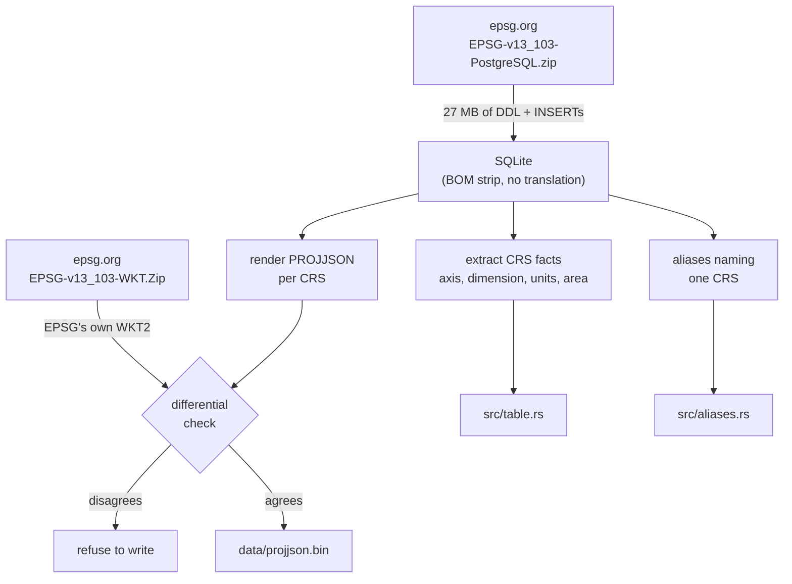

# xeibe-crs

EPSG CRS facts and PROJJSON definitions, for the axis-order decision and for
GeoArrow/GeoParquet CRS metadata, and EPSG's CRS aliases, for srsNames that
give a name (`PL-1992`) instead of a code. See `docs/geometry.md` for how they
are used.

Everything in `src/table.rs`, `src/aliases.rs` and `data/` is **generated** by
`scripts/gen_crs_tables.py`; do not edit any of it by hand. `src/lib.rs` and the
tests are hand-written.

The embedded data is the EPSG Geodetic Parameter Dataset, which is IOGP's, not
CC0 like the rest of this workspace. **[`EPSG-NOTICE.md`](EPSG-NOTICE.md) is the
notice the EPSG terms require us to pass on** — read it before redistributing
anything built from this crate.

## Where the data comes from

From the EPSG Dataset's own relational release, not from PROJ's `proj.db`:



No PROJ, GDAL, pyproj or network access is involved, at generation time or at
run time. Three reasons for going to EPSG directly rather than through PROJ:

- it is the authoritative source, and more current than whatever EPSG version a
  given PROJ release happens to bundle;
- it includes **deprecated** CRSs, which PROJ partly drops and the EPSG WKT
  release omits entirely. Real data uses them: `EPSG:27582` is deprecated and
  appears in our corpus;
- the PostgreSQL scripts load into SQLite unmodified apart from a UTF-8 BOM, so
  there is no SQL translation layer to get wrong.

## Regenerating

```sh
scripts/fetch_epsg_dataset.py                   # sign in, download into example_data/
scripts/gen_crs_tables.py                       # uses example_data/EPSG-*.zip
scripts/gen_crs_tables.py --sql PATH --wkt PATH
```

The archives come from <https://epsg.org/download-dataset.html>, which needs a
free account. `fetch_epsg_dataset.py` reads `EPSG_LOGIN_USER` and
`EPSG_LOGIN_PASSWORD` from the environment or a git-ignored `.env`. EPSG
publishes a few releases a year.

The script prints what it did, rewrites `Cargo.toml`'s version metadata and
prepends to [`CHANGELOG.md`](CHANGELOG.md) — one entry per EPSG release, with
EPSG's release note, the change requests behind it (resolved against the
dataset's `epsg_change` table) and the measured effect on this crate. Skipping
several releases still produces a complete history, and re-running adds
nothing.
It **refuses to write** if anything fails to render or if the WKT check
disagrees. Regeneration is reproducible: the same release always yields
byte-identical output.

### Automated

`.github/workflows/epsg.yml` runs daily. Its `check` job asks the public EPSG
API (no account) whether a newer release exists; if so the `update` job
downloads it, regenerates, runs the regression diff, the independent
verification and the tests, and opens a pull request whose description carries
EPSG's own release notes.

Both jobs live in one workflow because a workflow cannot reliably dispatch
another with `GITHUB_TOKEN` — events raised by that token do not start new runs
— so `needs:` is the dependable gate.

The update job signs in with the `EPSG_LOGIN_USER`/`EPSG_LOGIN_PASSWORD`
secrets, or takes the two archive URLs directly if you would rather configure
no secrets.

The sign-in is an OpenID Connect flow and works headless — no browser needed.
Two things make it fiddly: the login form's submit button is a named field
(`button=login`) whose absence is treated as a *cancel*, and the OIDC result
comes back as a self-submitting `form_post` whose markup uses single quotes.
The credentials only ever read the link targets off the gated page; the
archives themselves are public CDN URLs fetched unauthenticated.

## Verifying

`scripts/verify_crs_tables.py` adds what the WKT gate cannot cover:

| check | what it catches |
|---|---|
| `--self` | blob index, facts table and documents disagreeing |
| `--schema` | invalid PROJJSON, **including the deprecated CRSs** |
| `--pyproj` | semantic differences against an independent implementation |
| `--regression` | codes removed, axis orders flipped, units changed since the last release |

The schema check earns its keep: it found four doubly-derived vertical CRSs
(`EPSG:8051` = MSL depth (ft) ← MSL depth ← MSL height) emitted as nested
`DerivedVerticalCRS`, which PROJJSON forbids — and which the WKT oracle was
blind to, because those are exactly the four CRSs EPSG's own WKT export gives
up on.

PROJ diverges from us in two known ways, both allow-listed by name so a *new*
divergence fails: it flattens derived vertical CRSs, and it omits the
Krovak Modified coefficients that EPSG defines. EPSG's own WKT backs our
rendering in both cases.

## The correctness gate

EPSG also publishes every non-deprecated CRS as WKT2:2019 — an independent
rendering of the same database, by EPSG, already normalised. The generator
parses it and compares projection method, parameter values and axis directions
against its own output. It currently agrees on **7,465/7,465** comparable CRSs.

This matters more than schema validation, because the failure mode here is not
invalid output: it is *plausible* output with wrong numbers. Every normalisation
bug found so far produced well-formed, schema-valid, silently incorrect data,
and the WKT diff is what caught them. The WKT release covers non-deprecated CRSs
only, which is exactly why it is the oracle and not the source.

## Normalisations applied to the raw tables

EPSG's relational data is not normalised for direct use. The EPSG terms permit
representation changes that preserve numeric equivalence, and these are the ones
made (`EPSG-NOTICE.md` states them for redistribution purposes):

- **Sexagesimal angles are decoded.** Units of measure 9110 (`DDD.MMSSsss`),
  9111 (`DDD.MMm`) and 9121 pack degrees, minutes and seconds into one decimal
  number, positionally, right-padded: `-58.3` is −58°30′ = −58.5°, not −58.3°
  and not −58°03′. This affects 2,692 CRSs. Those units have no conversion
  factor, so generic unit handling would pass the raw number straight through —
  the generator therefore **asserts** rather than defaulting. Values are decoded
  *and* relabelled as degrees. Fields are never range-checked: EPSG:10788
  genuinely stores `44.75` meaning 44°75′ = 45.25°.
- **Degree display formats take the degree factor.** Units 9107, 9108 and
  9115–9120 describe how a degree is *written* ("45°30′15″N"), not what it
  measures.
- **Unit 9122** ("degree (supplier to define representation)") is emitted as
  unit 9102 ("degree").
- **Spheres use the radius form.** `ellipsoid_shape = 0` becomes PROJJSON's
  `{"radius": …}` rather than equal semi-axes.
- **20 worked examples are skipped.** EPSG publishes entries like `EPSG seismic
  bin grid example A` and `enter here name of I=J+90 bin grid` as if they were
  CRSs. PROJ omits them too.

Nothing else is recalculated, re-fitted or reprojected.

## Why the two tables have different shapes

|  | `src/table.rs` | `data/projjson.bin` |
|---|---|---|
| Used | on the axis-order hot path | once per geometry column, only when writing metadata |
| Size | 2.3 MB of Rust source | 424 KiB for all 8,299 CRSs |
| Form | sorted `static` array | 130 zstd frames of 64 CRSs |
| Cost | binary search, no allocation or lazy init | one frame (~98 KiB) decompressed and cached |

`table.rs` is generated Rust rather than a binary blob because it is small
enough to stay readable and reviewable in diffs, needs no parsing code, and is
const-evaluated — it adds under a second to a clean build despite its size.

PROJJSON is 12.5 MiB raw and compresses to 2.8% of that, so it cannot be a
`static`. Sharding by code means a lookup decompresses ~98 KiB instead of the
whole thing, and shards are cached after first touch. `src/lib.rs` documents the
container layout.

## Deliberate limits

- **Areas of use are EPSG's own WGS 84 bounds, verbatim.** They are *not*
  reprojected into each CRS's units or axis order: that needs a projection
  engine, and the result would be our number rather than EPSG's — which the EPSG
  terms would not let us attribute to the dataset. `area_in_axis_order()`
  therefore returns `None` for projected CRSs, so the range check abstains
  rather than comparing metres against degrees.
- **No coordinate transformations.** Only CRS definitions are extracted. xeibe
  never reprojects.
- **CRS names change between EPSG releases** and must never be matched on.
  EPSG:2180 is `ETRS89 / PL-1992` in v13.103 and was `ETRF2000-PL / CS92` in
  v12.029.

## Versioning

```
0.1.0+epsg-13.103
└─┬──┘ └────┬────┘
  │         └── the EPSG Dataset version, rewritten by the generator
  └── the crate's own API version, hand-maintained
```

The semver core keeps meaning API compatibility; the EPSG version rides along as
build metadata, which Cargo shows but ignores when resolving. This is the same
approach `curl-sys` and `libgit2-sys` use for bundled sources.

EPSG's numbering cannot be used as `major.minor` directly: `13.005` is not a
legal semver minor ("invalid leading zero"), `12.059a` and `12.059b` are real
releases with letters in them, and v13 runs two parallel streams (13.001–13.005
alongside 13.101–13.103, two of them released the same day) so the minor can go
backwards.

`EPSG_VERSION` and `EPSG_DATE` are also exposed as consts, and a test asserts
they match the Cargo version so the two cannot drift.
