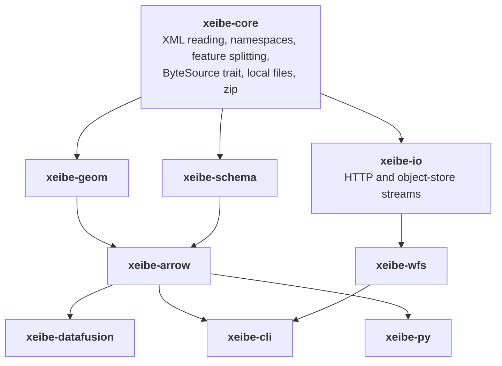
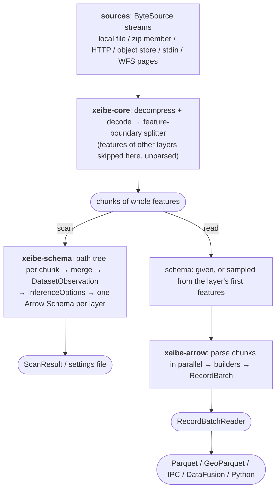
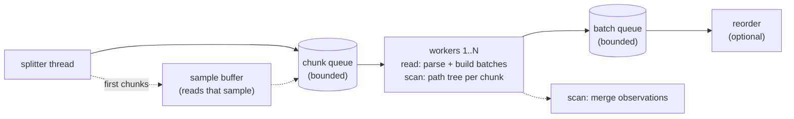

# Architecture

## Principles

1. **Bounded memory.** Memory use depends on the settings, never on input size:
   roughly `target_chunk_bytes × (queue_depth + threads)` for chunks, plus the
   batches in flight, the buffered sample, and at most one WFS page. See
   [Memory](#memory).
2. **Observation before policy.** Scanning collects facts. Separate rules turn
   those facts into a schema.
3. **Lossless by default, lossy by opt-in.** Examples: linearizing curves, allowing
   lossy type conversions. A schema from a scan describes everything the scan saw.
   Leaving columns out of a schema is how a user chooses not to read something.
4. **Arrow-native.** The output is always `RecordBatch`es. Formats such as Parquet
   and GeoParquet, and engines such as DataFusion, SedonaDB and Python, are
   separate layers built on top.
5. **Explainable.** Every schema decision can be traced back to the observation
   that caused it.
6. **Stateless.** Every input is read as a stream from start to end. The library
   keeps no cache, no index and no files of its own. What is worth keeping (a
   schema) is handed to the user, who decides where it lives.

## User-facing API: scan and read

There are two operations:

| Operation | Input | Output |
|---|---|---|
| **scan** | sources; full or a sample | every layer (feature type) found, with its inferred schema and summary. Can be saved as a [settings file](#settings-file) |
| **read** | sources, **one layer**, optionally a schema | a `RecordBatchReader` for that layer. The schema says which XML paths are read and into which columns |

```rust
// Scan once (full, or the first N features of the input), keep the result.
let scan = xeibe_arrow::scan(sources, ScanExtent::Full, &options)?;
for layer in scan.layers() { println!("{} {:?}", layer.name, layer.feature_count); }
scan.to_settings()?.save("prg.gml.json")?;

// Read with a known schema: one pass, no inference.
let settings = Settings::load("prg.gml.json")?;
let schema = settings.schema("AD_PunktAdresowy")?;
let reader = xeibe_arrow::read(sources, "AD_PunktAdresowy", Some(schema), &settings.options)?;

// Or read without a schema: inferred from the first features of that layer.
let reader = xeibe_arrow::read(sources, "AD_PunktAdresowy", None, &ReadOptions::default())?;
```

- A scan is done once. The schema it produces can be reused for later reads of the
  same data, and of other data of the same kind (for example, one voivodeship's PRG
  scan for all 16).
- A read without a schema samples the first `sample.features_per_layer` features
  **of the requested layer** (not of the file), infers a schema from them with
  conservative types, and then streams the rest. See
  [schema-inference.md](schema-inference.md#6-sampled-schemas).
- **The two are decoupled.** Naming, type rules and list detection belong to the
  scan (and to the sampling inside a read without a schema). A read only matches
  XML paths to columns. It doesn't need to know how a name was chosen.
- **The schema is also the projection.** Content whose path isn't in the schema is
  not read: whole subtrees that no column's path leads into are skipped unparsed.
  Nothing records what was skipped. This is how an old or hand-written schema
  meets new data. See [schema-inference.md](schema-inference.md#63-data-that-doesnt-fit).
- A **sampled scan** reads only the first N features of the input. Layers that start
  later in the file are not listed. Only a full scan guarantees the complete layer
  list. Choosing between them is up to the user.
- Scan and read are separate passes. For a remote source, a scan followed by a read
  downloads it twice. Reading with a saved schema, or with a sampled one, downloads
  it once.

### Settings file

Read parameters and schemas are kept apart. The same JSON file can hold either or
both:

```json
{
  "format_version": 1,
  "options": {
    "geometry": { "axis": "XY" }
  },
  "layers": {
    "prgad:AD_PunktAdresowy": {
      "@id": "text",
      "lokalnyId": { "type": "text", "path": "idIIP/*/lokalnyId" },
      "przestrzenNazw": { "type": "text", "path": "idIIP/*/przestrzenNazw" },
      "wersjaId": { "type": "timestamptz", "path": "idIIP/*/wersjaId" },
      "poczatekWersjiObiektu": "timestamp",
      "numerPorzadkowy": "text",
      "georeferencja": "geometry(Point)",
      "kodPocztowy": "text",
      "dataNadania": "date",
      "miejscowosc": { "type": "text", "path": "miejscowosc/@href" }
    },
    "xplan:BP_Plan": {
      "@id": "text",
      "referenzName": { "type": "text[]", "path": "externeReferenz[]/*/referenzName" },
      "referenzURL": { "type": "text[]", "path": "externeReferenz[]/*/referenzURL" },
      "datum": { "type": "date[]", "path": "externeReferenz[]/*/datum" },
      "raeumlicherGeltungsbereich": "geometry(MultiPolygon)"
    }
  }
}
```

- **`options`** is `ReadOptions` (see [below](#read-options)). Every key is optional,
  and parameters given on the command line or in code override the file.
  `xeibe scan` writes the options it used, with the axis-order decision as a plain
  mode (`"axis": "XY"`), so a later read doesn't depend on evidence gathering.
  Per-srsName overrides appear only when one input mixes srsNames that were decided
  differently (see [geometry.md](geometry.md#decision-key-and-scope)).
- **`layers`** maps each layer to its columns, in column order. Every column is
  nullable. A column is either `"name": "type"` or
  `"name": { "type": "…", "path": "…" }`. **Without `path`, the name is the
  path**, which is all a flat schema written by hand needs (`"nazwa": "text"`,
  `"@id": "text"`).
- The **name** is free. The scan suggests the shortest unique one (see
  [schema-inference.md](schema-inference.md#31-column-names)), and users can rename
  columns by editing it.
- CRS and axis order are **not** part of the schema. They come from the data
  (`srsName`) and from the options.
- In Rust, Python and DataFusion, a schema can be an ordinary Arrow `Schema` instead.
  The field name is the column name, and the field metadata `gml:path` is the path
  (without it, the name is the path). Geometry columns are recognized by their
  GeoArrow extension type.

**Paths.** A path is relative to the feature element:

| Syntax | Meaning | Example |
|---|---|---|
| `a/b/c` | child elements by local name | `idIIP/AD_IdentyfikatorIIP/lokalnyId` |
| `@name` | an attribute, as the last step | `miejscowosc/@href`, `@id` (the feature's `gml:id`) |
| `*` | any one element. The scan writes it for [type wrappers](schema-inference.md#32-structure), which can differ between features (XPlanung's `externeReferenz` holds an `XP_ExterneReferenz` or an `XP_SpezExterneReferenz`) | `idIIP/*/lokalnyId` |
| `[]` after a step | the **anchor** of a list column: the element whose occurrences the list follows (see [Lists](schema-inference.md#lists-and-alignment)). At most one per path | `externeReferenz[]/*/datum` |
| `prefix:name` | a namespace-qualified step, only needed when two siblings differ only by namespace. The prefix is declared in the settings file's top-level `"namespaces"` object (`"namespaces": { "gml": "http://www.opengis.net/gml/3.2" }`), or in the schema metadata `gml:ns` of an Arrow schema. It is never taken from the document | `gml:name` |

- A geometry column's path ends at the geometry **property** (`georeferencja`), not
  at the geometry element inside it.
- A `text` column whose path ends at an element with child elements receives that
  element's content as raw XML (used for mixed content).
- A list column without `[]` is anchored on its first step. The scan always writes
  `[]` for list columns.

**Types** are Arrow `DataType` strings as `arrow-schema` prints and parses them
(`Utf8View`, `Int64`, `List(Utf8View)`, `Timestamp(µs, "UTC")`), or one of these
aliases, which follow PostgreSQL and DuckDB. Aliases are case-insensitive, and the
scan writes them:

| Alias | Arrow type |
|---|---|
| `text`, `varchar`, `string` | `Utf8View` |
| `boolean`, `bool` | `Boolean` |
| `smallint`, `int2` / `integer`, `int`, `int4` / `bigint`, `int8` | `Int16` / `Int32` / `Int64` |
| `real`, `float4` / `double`, `double precision`, `float8` | `Float32` / `Float64` |
| `date` | `Date32` |
| `timestamp` / `timestamptz` | `Timestamp(µs)` / `Timestamp(µs, "UTC")` |
| `time` | `Time64(µs)` |
| `bytea`, `blob` | `Binary`: the geometry at the column's path as ISO WKB, without a GeoArrow type or CRS. `bytea[]` is a list of them, like `geometry[]` |
| `map` | `Map(Utf8View → Utf8View)` |
| `T[]` | `List(T)`, e.g. `text[]`, `date[]` |
| `geometry` | `geoarrow.wkb` |
| `geometry(<kind>[, <dims>])` | a native GeoArrow type, e.g. `geometry(MultiPolygon, XYZ)` |
| `geometry[]` | `List(geoarrow.wkb)`, for a geometry below a repeated element |

There is deliberately no `numeric` or `decimal`. They are rejected with a hint to
use `double` or `text` (see [type-mapping.md](type-mapping.md)).

### Read options

```rust
pub struct ReadOptions {
    pub geometry: GeometryOptions,       // axis order, CRS override, curves, primary column
    pub inference: InferenceOptions,     // reads without a schema only
    pub sample: SampleOptions,           // reads without a schema
    pub on_feature_error: OnFeatureError,
    pub splitter: SplitterOptions,
    pub batch_size: usize,
    pub threads: usize,
    pub preserve_order: bool,
    pub queue_depth: usize,              // bounded queue length (backpressure)
    pub projection: Option<Vec<String>>, // not serialized
}
```

`geometry` holds the only geometry options: axis order, CRS override, curve
linearization and the primary geometry column (see
[geometry.md](geometry.md#options)). They apply to every read. `inference` is
only used when a read has no schema and samples one.

## Crates



The integration crates (`xeibe-datafusion`, `xeibe-cli`, `xeibe-py`) also use `xeibe-io`
to turn paths and URLs into sources.

| Crate | Responsibility | Key dependencies |
|---|---|---|
| `xeibe-core` | Streaming XML reader on top of `quick-xml`; namespace context; GML version detection; **feature-boundary splitter**; input decompression (gzip/zstd) and character-encoding conversion; the synchronous `ByteSource` trait with local-file and one-shot-reader implementations; zip archives (local files only) | `quick-xml`, `encoding_rs`, `zip` |
| `xeibe-geom` | Parses GML geometry elements into an internal model that implements `geo-traits`; writes ISO WKB, curves included; axis-order handling | `geo-traits`, `wkb` |
| `xeibe-schema` | Scan → **path tree** (`DatasetObservation`); merging; `InferenceOptions`; rule engine → Arrow `Schema`; binding a given schema's paths to XML; `--explain` | `arrow-schema`, `serde` |
| `xeibe-arrow` | `scan()` and `read()`; settings file; feature → Arrow builders; parallel read pipeline | `arrow-array`, `geoarrow-array` |
| `xeibe-io` | `ByteSource`s that stream from HTTP(S) and object stores; resolving inputs (paths, globs, URLs, `archive.zip!/member`) | `reqwest` (feature `http`), `object_store` + `tokio` (feature `object-store`) |
| `xeibe-wfs` | WFS capabilities, hit counts, paging; pages streamed into a read | `xeibe-io` (HTTP client) |
| `xeibe-datafusion` | `TableProvider` for one layer; `read_gml()` table function; adapter from DataFusion's `ObjectStore` registry to `ByteSource`; SedonaDB integration | `datafusion` |
| `xeibe-cli` | `xeibe scan`, `xeibe convert` (one layer to Parquet or Arrow IPC), `xeibe wfs` | `clap`, `parquet` (feature `geospatial`) |
| `xeibe-py` | Python bindings: `scan()`, `read()` returning the Arrow C stream interface (PyCapsule) | `pyo3` |

`xeibe-core` and `xeibe-geom` must not depend on Arrow. `xeibe-core` must not depend on an
async runtime or an HTTP client.

### Module map

Where each design topic lives in the code (`crates/<crate>/src/…`):

| Topic (doc) | Modules |
|---|---|
| Feature splitting, chunks, namespaces, version (architecture.md) | `xeibe-core`: `splitter`, `chunk`, `namespace`, `qname`, `version`, `reader`, `decode`, `source` |
| Remote input (architecture.md) | `xeibe-io`: `http`, `object_store`, `resolve`, `options` |
| Zip archives (architecture.md) | `xeibe-core`: `archive` (on top of the `zip` crate) |
| Geometry model, `geo-traits`, WKB (geometry.md) | `xeibe-geom`: `model`, `traits`, `wkb`, `linearize` |
| Geometry parsing, coordinates, arcs (geometry.md) | `xeibe-geom`: `parse/{coords,primitives,curves,surfaces,aggregates,envelope}`, `arcs`, `dialect` |
| CRS, srsName forms, axis order (geometry.md) | `xeibe-geom`: `crs`, `epsg`, `axis`; `xeibe-arrow`: `axis` (applies decisions) |
| Geometry sampling during scans (schema-inference.md) | `xeibe-geom`: `sniff` |
| Path tree, value stats, merge, scan (schema-inference.md) | `xeibe-schema`: `observation`, `node`, `value`, `geometry_stats`, `merge`, `scan` |
| `InferenceOptions`, presets, rule engine, binding, `--explain` (schema-inference.md, type-mapping.md) | `xeibe-schema`: `options`, `presets`, `pattern`, `rules`, `bind`, `explain` |
| `scan()`, `read()`, settings file, path routes and list alignment, builders, pipeline, read report | `xeibe-arrow`: `api`, `settings`, `reader`, `route`, `feature`, `builders`, `geometry_column`, `value`, `pipeline`, `report`, `options` |
| WFS (wfs.md) | `xeibe-wfs`: `capabilities`, `request`, `response`, `paging`, `pages`, `http`, `exception`, `options` |
| DataFusion / SedonaDB | `xeibe-datafusion`: `table`, `partition`, `function` |
| CLI | `xeibe-cli`: `args`, `commands/*` (binary `xeibe`) |
| Python | `xeibe-py` (module `xeibe`) |

Arrow is pinned to **59** because `geoarrow-array` 0.9 and DataFusion 55 depend on it.
`xeibe-datafusion` and `xeibe-py` are not default workspace members (slow builds): use
`cargo check --workspace` or `-p`.

## Data flow



## Sources and remote input

Every input is read **once, from start to end**, whether it is a local file, an
object in S3 or a URL. Nothing depends on range requests, so servers without them
(such as `opendata.geoportal.gov.pl`) work like any other. Nothing is downloaded to
disk or cached. When a framework we are embedded in has a cache of its own, it
applies as usual.

```rust
/// Raw bytes of one input. Synchronous; `xeibe-io` bridges async stores.
pub trait ByteSource: Send + Sync + Debug {
    fn name(&self) -> &str;                         // path or URL, for messages
    fn len(&self) -> Option<u64>;                   // for progress, if known
    fn open(&self) -> Result<Box<dyn Read + Send>>; // a fresh stream from the start
}
```

- **Local files** are opened with `File::open`.
- **HTTP(S)** (`xeibe-io`, blocking `reqwest`) is one `GET`, read as it arrives. Retries
  (5xx, 429 with `Retry-After`, network errors) happen only before the first byte
  was handed on. A connection that breaks mid-body fails the read, and the user
  reruns it.
- **Object stores** (`xeibe-io`, feature `object-store`) are one streaming `get`. The
  async body runs on a tokio runtime and reaches the splitter through a bounded
  channel. Parsing stays synchronous and CPU-bound.
- **stdin** and other one-shot readers can be opened once. A read with a given or
  sampled schema works. A scan followed by a read needs the data twice, so the
  second open fails with `NotReopenable`.
- Compression in transit (`Content-Encoding: gzip`) is removed by the HTTP client.
  A compressed file (`.gml.gz`) is detected from its magic bytes after that.

Several sources (a directory, a glob, WFS pages) are passed as `Sources`: a list,
or a lazily produced sequence (`Sources::lazy`), which is how WFS pages arrive.

## Layers (feature types)

Each distinct feature element, identified by `QName` = namespace URI + local name,
becomes a **layer**. This matches GDAL/QGIS, where a GML file with several feature
types offers a "select layers" dialog. A read returns one layer.

Layers can be stored one after another (PRG) or interleaved. Either way, a read
passes over the whole input. The splitter recognizes each feature's element name
without parsing it, so features of other layers are skipped at splitting speed.
Reading PRG's `AD_PunktAdresowy`, which starts after the other two layers, costs a
pass over the bytes before it, not a parse of them.

Reading several layers of one input means one read per layer. There is no
multi-output read: with several outputs consumed at different speeds, the fast
ones would have to buffer without bound.

## Feature-boundary splitter

The splitter cuts the decoded stream into chunks that can be parsed in parallel. It
does **not** fully parse the XML. It only tracks element depth and recognizes
feature-member containers (`SplitterOptions.member_rules`):

- `gml:featureMember` (one feature per element)
- children of `gml:featureMembers` (several features in one element)
- `wfs:member` (WFS 2.0)
- a configurable list for application schemas that define their own collections

A document whose root element *is* a feature, with no collection around it (e.g. a
WFS 2.0 `GetFeatureById` response), is read as a one-feature dataset when
`allow_single_feature_root` is set.

Before the first chunk, the splitter reads everything up to the first feature
member into a **document header**: the root element, its namespace declarations,
`xsi:schemaLocation`, the WFS response attributes (`numberMatched`,
`numberReturned`, `next`; WFS 1.1 `numberOfFeatures`) and whether the root declares
the FME namespace. WFS paging uses the response attributes, and axis-order
evidence uses the FME flag (see [geometry.md](geometry.md#auto-evidence-based-decision)).

Details:
- Namespace declarations from the root element and the ancestors of the feature
  container are recorded once and passed to every chunk. A chunk can then be parsed
  on its own.
- A collection's `boundedBy` (`gml:boundedBy`, or `wfs:boundedBy` in WFS 2.0) is
  copied as written and passed to the chunks of the features it bounds
  (`FeatureChunk::collection_bounded_by`), which inherit its srsName and
  srsDimension (see [geometry.md](geometry.md#srsname-inheritance)). In a WFS 2.0
  response with several queries each inner collection passes on its own, and a
  chunk never spans two of them.
- Comments, CDATA, processing instructions and quoted attribute values are handled
  correctly, so a `<` inside them doesn't mislead the splitter.
- With a layer filter (every read), features of other layers never enter a chunk.
- Chunks are cut at the first feature boundary after `target_chunk_bytes` (planned
  default in the 16–64 MB range). A single feature larger than that becomes a chunk
  of its own, so the largest feature sets a floor on chunk memory. Chunks carry a
  sequence number so the output order can be restored.

## Parallel pipeline



- The splitter is the only sequential stage. It does far less work per byte than
  parsing, so one splitter keeps several workers busy.
- Bounded queues provide backpressure, so memory stays bounded when a slow sink
  (such as a Parquet writer) is downstream.
- The reorder stage emits batches in order of their sequence number. It can be
  disabled for maximum throughput when row order doesn't matter.
- Workers never share builders. Each worker produces complete batches for its chunk,
  and small batches from different chunks can be combined before output.
- Several sources are split one after another into the same chunk queue.
- **Scans use the same stages.** Each worker builds a path tree for its chunk
  (`Scanner::scan_chunk`), and the per-chunk observations are merged. There is no
  batch queue or reorder stage, because a scan produces one observation.
- **Sampling happens before the workers start.** A read without a schema, or an
  `Auto` axis-order decision with a given schema, first takes the layer's chunks
  from the splitter one at a time until `sample.features_per_layer` features are
  in. It infers the schema or decides the axis order from them, then starts the
  workers and feeds them the buffered chunks first, followed by the rest of the
  stream. Nothing is read twice.

### Memory

Every stage holds a bounded amount, set by `ReadOptions`:

| What | At most |
|---|---|
| Chunks waiting in the chunk queue | `queue_depth` chunks |
| Chunks being parsed | one per worker (`threads`) |
| Chunk size | `target_chunk_bytes`, or the largest single feature if bigger |
| Batches waiting | `queue_depth` batches of up to `batch_size` rows (more while reordering waits for an earlier chunk) |
| Sample buffer | the chunks holding the first `sample.features_per_layer` features of the layer, until the workers take them |
| WFS | one page, fetched whole before it is parsed (see [wfs.md](wfs.md)) |

With 64 MB chunks, 8 workers and a queue depth of 8, chunks alone can take about
1 GB. Smaller `target_chunk_bytes` or `queue_depth` lowers that at some cost in
parallelism.

## Error handling

Per-feature errors, such as malformed coordinates or unparseable XML inside one
feature, are governed by `OnFeatureError`:

| Policy | Behaviour |
|---|---|
| `Error` (default for library) | Stop with location (file, byte offset, feature seq, `gml:id`) |
| `Skip` | Skip the feature and record it in the read report |
| `NullGeometry` | Keep the attributes and set the geometry to null. Only applies to geometry errors |

A **missing value in a non-null field** is also a feature error. Inferred schemas
and settings files never have non-null fields, but an Arrow schema passed in from
code (e.g. a `pyarrow.Schema`) can. When a feature has no value for such a field
(the element is absent, empty with `empty_as_null`, or `xsi:nil`), `OnFeatureError`
applies as above. `NullGeometry` can't help here when the field is the geometry
itself, so it stops like `Error`.

A **value that doesn't fit its column** is a feature error too: one that doesn't
parse as the column's type (`abc` in a `bigint` column, a timestamp in a `date`
column), or a second value where the column holds one (a repeated element in a
scalar column, or twice within one anchor occurrence of a list). So is a geometry
kind that a native geometry column can't hold (a `MultiPolygon` in a
`geometry(Polygon)` column). The latter is a geometry error, so `NullGeometry`
applies to it.

Every read produces a **report**: the feature count, skipped features and warnings
(for example, an unknown srsName). Content outside the schema isn't counted. A sampled read
also reports the schema it inferred, in settings-file form, ready to be saved.

## Input handling

- Compression: gzip and zstd are detected from magic bytes and decompressed as a
  stream in front of the splitter. DataFusion and Spark treat compressed files the
  same way.
- Zip archives: see [Zip archives](#zip-archives).
- Encoding: UTF-8 is the fast path. Other encodings declared in the XML header
  (ISO-8859-x, windows-125x, UTF-16) are converted to UTF-8 with `encoding_rs`.
- Multiple sources, such as a directory, a glob or a WFS request's pages, form one
  input. A scan merges their path trees, so they share a schema per layer.
- Security: DTDs are never processed and external entities are never resolved
  (protection against XXE and billion-laughs attacks).

### Zip archives

Real GML distributions (INSPIRE portals, geoportal.gov.pl) are usually zip files,
so zip is supported, but kept minimal. No mainstream Arrow engine (DataFusion,
Spark, Polars) reads zip at all. Only GDAL does.

- Zip files are read with the `zip` crate as it is: stored and deflate members,
  zip64, and member-name decoding. Other methods (deflate64, bzip2, LZMA, zstd) and
  encrypted members fail with an error naming the method. There is no zip-specific
  code beyond that.
- **Only local zip files.** The central directory is at the end of the archive, so
  zip needs random access. A remote zip is an error (`RemoteArchive`) that tells the
  user to download it first. Zips are never read from start to end.
- **Member selection:** `.gml`, `.xml`, `.gml.gz` and `.xml.gz` members are
  candidates. A candidate in which the splitter finds no feature collection or
  feature member (for example ISO metadata `gmd:MD_Metadata`) is skipped and listed
  in the read report. In the test corpus, 333 of the GML members are named `.xml`,
  more than the 186 named `.gml`. Other members (shapefiles, PDFs, XSDs, …) are
  ignored. A zip with no GML member is an error.
- All selected members of one archive form **one input**, like a directory.
- `archive.zip!/dir/file.gml` selects a single member. `--member <glob>` selects
  several. Member names are shown as the `zip` crate decodes them.
- Not supported: zips inside zips (29 in the corpus, none containing GML).

## Integrations

### DataFusion

- `GmlTable: TableProvider` serves **one layer**. Its schema is either given (an Arrow
  schema or a settings file) or inferred when the table is created, from a sample of
  that layer. This is how DataFusion's CSV and JSON readers work
  (`schema_infer_max_records`).
- Each source is one partition. A single source is still read in parallel inside
  its partition (splitter plus workers).
- **Network I/O belongs to DataFusion.** URLs, the object store registry
  (`register_object_store`), S3/GCS/Azure/HTTP clients, credentials and retries all
  come from `object_store`. We adapt a registered `ObjectStore` to `ByteSource` and
  read it with one streaming `get`, so servers without range support work.
  `HttpStore` lists directories with WebDAV `PROPFIND`, so plain web servers work
  only with URLs to single files.
- We add no cache. Whatever caching DataFusion or SedonaDB configure applies.
- Blocking work (parsing, `ByteSource` reads) runs in `spawn_blocking`, never on a
  tokio worker thread.
- A table function: `read_gml('path/*.gml', 'AD_PunktAdresowy', 'settings=prg.gml.json')`.
  Options after the layer are `'key=value'` strings, because DataFusion's SQL
  planner passes no named arguments (`layer => …`) to table functions.
- Projection pushdown means columns that aren't selected are skipped without being
  built.

### SedonaDB

SedonaDB is built on DataFusion and stores geometry as `geoarrow.wkb`. Integration
means registering `xeibe-datafusion` in SedonaDB's context. The plan is to offer it
upstream as a thin adapter crate once the API is stable. Until then SedonaDB reads
GML only through pyogrio/GDAL.

### Python

```python
scan = xeibe.scan(paths, sample=None)   # .layers, .schema(layer) -> pyarrow.Schema, .save(path)
reader = xeibe.read(paths, "AD_PunktAdresowy", schema=None, options=None)
```

`schema` accepts a `pyarrow.Schema` (or anything with `__arrow_c_schema__`) or a
settings-file path. The reader implements `__arrow_c_stream__`, so it works directly
with PyArrow, GeoPandas (`from_arrow`), DuckDB, Polars and SedonaDB's Python API.

### CLI

The CLI is deliberately simple: one command per operation, one layer per output.

```
xeibe scan    <src>… [--sample N] [--preset …] [--explain] [-o settings.json]
xeibe convert <src>… --layer <name> -o out.parquet [--settings settings.json] [--format parquet|ipc] [--bbox-column auto|always|never] [--row-group-size N] [options…]
xeibe wfs layers  <url>
xeibe wfs count   <url> --type-name <name>
xeibe wfs convert <url> --type-name <name> -o out.parquet [--settings settings.json] [--page-size N]
```

- `<src>` can be a path, a glob, a directory, `archive.zip!/member.gml`, `-` (stdin),
  or an `http(s)://`, `s3://`, `gs://` or `az://` URL (object stores need the
  `object-store` feature).
- `xeibe scan` without `-o` prints the layers with their feature counts, geometry and
  CRS, and the extent the collection declares in its `boundedBy`, if it does.
  Axis-order conflicts are printed first.
- `xeibe convert` without `--settings` samples the layer. Options such as
  `--axis-order`, `--crs`, `--linearize` and `--preset` override the settings file.
- Converting several layers means running `xeibe convert` once per layer.

### Parquet and GeoParquet output

See [geometry.md](geometry.md#parquet-and-geoparquet-output). In short, by default
geometry is written as WKB with the native Parquet `GEOMETRY` logical type, which
gives bbox statistics per row group, plus GeoParquet 1.1 `geo` metadata. A
column with curves is an error unless `--linearize` is given. Row groups hold
128,000 rows (`--row-group-size`). The Parquet writer keeps a whole row group
in memory, outside the bounds in [Memory](#memory).

## Non-goals and deliberate limits

- **One-way only: GML → GeoArrow.** This project reads GML. It will never write
  GML (no GML encoder, no round-tripping, no WFS-T). Design choices such as
  `@` attributes, path metadata and lossless value rules aim for faithful reading.
  They do not aim for re-serialization.
- **No state of our own.** No download cache, no saved indexes, no saved WFS pages.
  Reads never need range requests. The only thing that persists is a settings file
  the user asked for.
- No reading several layers in one pass.
- No resolution of `xlink:href`, so no global id index. Links stay strings.
- No CityGML. No support for solids beyond what is described in the
  [support matrix](support-matrix.md).
- No XSD-driven mapping. XSDs may later be used only as hints.
