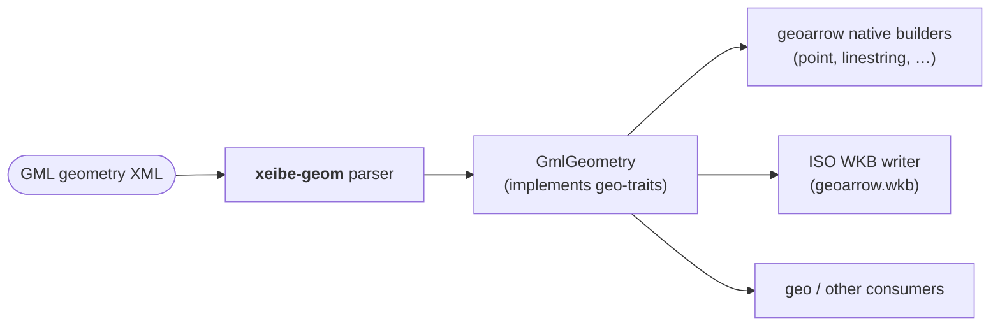

# Geometry

How GML geometry elements become GeoArrow columns. The exact list of supported and
planned elements is in [support-matrix.md](support-matrix.md#5-geometry).

References (PDFs in `ogc_schemas/`):
- GML 3.2.1 (OGC 07-036) §10–11;
- GML 3.1.1 (OGC 03-105r1);
- GML 2.1.2 (OGC 02-069);
- GML Simple Features Profile 2.0 (OGC 10-100r3);
- URN definitions (OGC 07-092r3), Name Type Specification (OGC 09-048r7),
  CRS Name Type Specification (OGC 11-135r2).

Where the specs are silent or ambiguous, we follow **GDAL's behaviour**
(`ogr/gml2ogrgeometry.cpp`), because most existing data has been checked against it.
Those places are marked **[GDAL]**.

## Pipeline



- The internal model follows ISO 19107 closely enough to preserve curves, and its
  simple-feature parts implement `geo-traits`. Curve types are written only by the
  WKB writer.
- The parser works on one geometry at a time, inside the feature currently being
  read, so memory is bounded by the largest single geometry.

## Options

Geometry has few options. All of them are read parameters, kept in the settings
file under `options.geometry`, not in the schema:

```rust
pub struct GeometryOptions {
    pub axis: AxisOrderOptions,       // mode + { srsName → mode } overrides, see CRS and axis order
    pub crs_override: Option<String>, // replaces the CRS from the data
    pub curves: CurveMode,            // Preserve (default) | Linearize { max_angle_step_deg, max_gap }
    pub primary: Option<String>,      // column name → GeoParquet primary_column
}
```

The scan has one more, `InferenceOptions.geometry_encoding` (below), because the
encoding ends up as the column's type. Everything else is fixed behaviour:

| Behaviour | Rule |
|---|---|
| Dimensions | From the column's type (`geometry(Point)` = XY, `geometry(Point, XYZ)`). A Z value in an XY column is a feature error. WKB columns keep what is written |
| Coordinates of native columns | Always separated (struct), as GeoParquet's native encoding requires |
| One column's srsNames resolve to more than one CRS | Feature error ([CRS metadata](#crs-metadata)) |
| Unsupported geometry (solids, splines, …) | Geometry error, handled by `OnFeatureError` ([Unsupported geometry](#unsupported-geometry)) |
| Unclosed ring | Closed, with a warning |
| Too few positions (LineString < 2, LinearRing < 4) | Feature error |
| Gap between segments | Fixed tolerance of 1e-9 × the geometry's extent ([Joining](#joining-segments-and-members)) |

To keep the source GML of a geometry (for example, the parameters of an
`ArcByCenterPoint`), add a `text` column whose path is the geometry property. A
`text` column at an element with children receives its raw XML.

## Column encoding

`InferenceOptions.geometry_encoding` (scan and read sample only; a given schema
already names each column's type):

| Mode | Behaviour |
|---|---|
| `Auto` (default) | Chosen per column from the scan's (or the read sample's) `GeometryStats`. With `curves = Linearize`, curves count as their linear types (`CircularString` → `LineString`, `CurvePolygon` → `Polygon`, …): <br>• one simple kind → its native GeoArrow type (`point`, `linestring`, `polygon`, `multipoint`, `multilinestring`, `multipolygon`) <br>• a kind and its Multi form (Polygon + MultiPolygon) → the Multi type, as GDAL's `PROMOTE_TO_MULTI` does. A single Polygon then reads as a one-part MultiPolygon <br>• anything else (unrelated kinds, curves, unusual kinds) → `geoarrow.wkb` |
| `Wkb` | Always `geoarrow.wkb` (ISO WKB) |

There is no `geoarrow.geometry` (union) output: downstream support is poor, and the
Parquet writer turns it into WKB anyway. Dimensions come from `GeometryStats.dims`:
`xy` or `xyz`. Mixed 2D/3D becomes `xyz`, with Z set to NaN for 2D values.
Measures (`m`) are not part of GML simple geometry.

## Mapping table

| GML | Output (lossless) | Notes |
|---|---|---|
| `Point` | Point | |
| `LineString` | LineString | At least 2 positions (07-036 §10.4.4) |
| `LinearRing` | ring | At least 4 positions; first = last (§10.5.8). See [validation](#empty-invalid-and-degenerate-geometry) |
| `Polygon` (`exterior`/`interior`; GML 2 and deprecated 3.x `outerBoundaryIs`/`innerBoundaryIs`) | Polygon / CurvePolygon | |
| `Curve` with only `LineStringSegment`s | LineString | Segments joined. The shared start point of each following segment is dropped |
| `Curve` with a single arc-type segment | CircularString | |
| `Curve` with mixed segments | CompoundCurve | Consecutive linear segments merge into one LineString part, consecutive arcs into one CircularString part |
| `Arc`, `ArcString` | CircularString | Stored control points copied exactly. See [arcs](#arcs-given-by-points) |
| `Circle` | CircularString, 5 points, closed | See [arcs](#arcs-given-by-points) |
| `ArcByCenterPoint`, `CircleByCenterPoint` | CircularString | Computed. See [arcs](#arcs-given-by-parameters) |
| `ArcByBulge`, `ArcStringByBulge` | CircularString | Computed. See [arcs](#arcs-given-by-parameters) |
| `Ring` (made of `curveMember`s) | ring: LineString / CompoundCurve | The members "shall be contiguous and connected in a cycle" (§10.5.11.1). Members may be nested `CompositeCurve`s |
| `Surface` with one `PolygonPatch` | Polygon / CurvePolygon | |
| `Surface` with several patches | MultiPolygon / MultiSurface | The patches of one surface are "connected" (§10.5.10). They are kept as separate parts, not dissolved |
| `Triangle`, `Rectangle` patches | Polygon | Ring of 4 and 5 positions respectively (§10.5.12.5–6) |
| `OrientableCurve` (`baseCurve`, `orientation`) | curve, reversed if `orientation="-"` | May nest (§10.4.6). A `baseCurve` given by `xlink:href` is unsupported (no resolution) |
| `OrientableSurface` (`baseSurface`, `orientation`) | surface with reversed rings if `"-"` | May nest (§10.5.11) |
| `CompositeCurve` | LineString (if linear) / CompoundCurve | Members form a sequence, each ending where the next begins (§11.2.2.2) |
| `CompositeSurface` | MultiPolygon / MultiSurface | The members are kept, not dissolved |
| `MultiPoint` (`pointMember(s)`) | MultiPoint | |
| `MultiLineString` (GML 2/3.1) / `MultiCurve` | MultiLineString / MultiCurve | |
| `MultiPolygon` (GML 2/3.1) / `MultiSurface` | MultiPolygon / MultiSurface | |
| `MultiGeometry` | GeometryCollection | |
| `Envelope` / `Box` as a *property value* | Polygon (5 points) | As `boundedBy`: see type-mapping |

Legacy elements are accepted in every version (lenient reading), for example
GML 2's `MultiPolygon` inside a GML 3.2 document. Real data mixes versions.

### Joining segments and members

The standard requires each segment (or composite/ring member) to start exactly where
the previous one ended (07-036 §10.4.5, §11.2.2.2). When joining:

- If the start point equals the previous end point exactly, it is dropped.
- If they differ by no more than a fixed tolerance of 1e-9 × the geometry's
  extent, the start point is dropped and a warning is counted. Otherwise both points
  are kept and a warning is logged.
- **Stored coordinates always win over computed ones.** When a computed arc endpoint
  (see below) meets a stored coordinate, the stored value is used. Rounding errors
  from computed arcs therefore never move points that were in the source data.

## Arcs given by points

These are **lossless**: every coordinate from the source is kept exactly.

| Element | Rule | Output |
|---|---|---|
| `ArcString` | Uses "circularArc3Points". Number of positions = `2 × numArc + 1` (§10.4.7.5) | CircularString with the same points |
| `Arc` | An ArcString with `numArc = 1`, i.e. 3 positions (§10.4.7.6). **[GDAL]** Any odd count ≥ 3 is accepted, because `Arc` with 5 or more positions occurs in real data | CircularString |
| `Circle` | 3 distinct, non-collinear points. The arc continues past the third point until it reaches the first (§10.4.7.7) | **[GDAL]** Closed CircularString `p1 p2 p3 m p1`, where `m` is the midpoint of the arc from `p3` back to `p1`. The three source points are kept, the direction of travel is preserved, and only `m` is computed |

A wrong number of positions (even, or fewer than 3) is an error for that feature,
handled by `OnFeatureError`. A `numArc` that doesn't match the number of positions
gives a warning, and the positions are used.

## Arcs given by parameters

The source stores parameters (center, radius, angles, bulge), not points on the arc.
The CircularString control points have to be **computed**, so the output is exact
only up to floating-point rounding. The original parameters are **not** kept. To
keep the source XML alongside the geometry, add a `text` column whose path is the
geometry property.

### `ArcByCenterPoint` and `CircleByCenterPoint`

Spec (§10.4.7.10–11): a center point (`pos`), `radius` (with `uom`), and `startAngle` /
`endAngle`, described as the "bearing" at the start and end. **Only allowed in 2D.**
`CircleByCenterPoint` has identical start and end angles. The standard does not say
which direction angle 0 points or which way the angles turn. The Simple Features
profile (10-100r3 §8.4.4.11.2, Table 6) explicitly allows `CircleByCenterPoint`.

**[GDAL]** interpretation, which we adopt:

| CRS kind | Angles | Arc | Output |
|---|---|---|---|
| Projected or unknown | Degrees, counter-clockwise from the +x (east) axis (mathematical convention). `uom` of angles: `deg` (default) or `rad` | From `startAngle` to `endAngle` through their mean angle, so the arc turns counter-clockwise if `end > start` and clockwise otherwise | CircularString: `start, mid, end` |
| Projected, radius `uom` is a length unit | — | Radius converted: `uom` → metres → the CRS's linear unit | — |
| `CircleByCenterPoint`, projected | — | Full circle | CircularString with 5 points: west, north, east, south, west (clockwise, as in GDAL) |
| **Geographic** CRS with the radius in a length unit (aviation/AIXM data) | Bearings: clockwise from north (the Eurocontrol interpretation used by GDAL) | A circle on the ellipsoid (geodesic distance), which can't be represented as a CircularString in lon/lat | **Lossy.** Linearized along the geodesic with the `Linearize` step `max_angle_step_deg` (default 4°, as GDAL). Status 🤔 Considering |

### `ArcByBulge` and `ArcStringByBulge`

Spec (§10.4.7.8–9): the start and end points of each arc, plus `bulge` and `normal`
per arc. The number of positions is `numArc + 1`, and the mid-arc points are computed.
The formula is in ISO 19107:2003 §6.4.17, which we don't have.

**[GDAL]** formula, adopted until verified: for each arc with chord `p0 → p1`,
- `mid = (p0 + p1) / 2`
- `n̂` = unit vector perpendicular to the chord, rotated 90° counter-clockwise from
  `p1 − p0`
- the arc's middle control point is `mid + n̂ × bulge × normal`, using the first
  component of `normal`.

> ⚠️ Needs a test case with known geometry before this is marked ✅. It's rare in
> practice, so it stays P2.

## Coordinates

| Encoding | Versions | Rules |
|---|---|---|
| `<gml:pos>` | 3.x | One position |
| `<gml:posList>` | 3.x | `srsDimension`, `count`. If `count` is present, `srsDimension` must be too (§10.1.4.2). Number of values = dimension × count |
| `<gml:posList dimension="…">` | **3.0 only** | Legacy attribute. 3.1.1 already uses `srsDimension`. Accepted as a synonym |
| `<gml:coordinates>` | 2, 3.x (deprecated) | Attributes `decimal` (default `.`), `cs` (default `,`), `ts` (default space) (02-069 §4.3.1). When `ts` is whitespace, any run of whitespace separates tuples (lenient) |
| `<gml:coord><X/><Y/><Z/></gml:coord>` | 2, 3.1 (deprecated) | |
| `<gml:pointProperty>` / `<gml:pointRep>` in a LineString or ring | 3.x | Inline points only. Mixing with `pos` is allowed (§10.1.4.3–4). A point given by `xlink:href` is unsupported |

The Simple Features profile only allows `pos` (for Point and CircleByCenterPoint) and
`posList` (for everything else) (10-100r3). The reader accepts all of the forms
above anyway.

Numbers are parsed with a fast float parser straight from the byte buffer, without
creating intermediate strings.

### Dimension

The standard says `srsDimension` "is derived from the coordinate reference system"
and must be omitted when `srsName` is omitted (07-036 §10.1.3.2). The effective
dimension is determined in this order:

1. `srsDimension` on the `pos`/`posList`;
2. `srsDimension` on the nearest ancestor geometry;
3. the dimension of the CRS, from the built-in EPSG table (e.g. EPSG:4979, compound CRSs → 3);
4. for `pos`: the number of values; for `posList` with `count`: values ÷ count;
5. otherwise 2.

Rule 4 means a `posList` without `srsDimension` or `count` in an unknown 3D CRS is
read as 2D. This happens in real data and can't be detected reliably. The reader
warns when the number of values isn't divisible by 2 but is divisible by 3.

### srsName inheritance

The CRS of a geometry comes from the nearest declaration (07-036 §10.1.3.2, §10.1.4.1;
10-100r3 §8.4.4.11.3):

```
wfs:/gml:FeatureCollection boundedBy/Envelope/@srsName     (collection level)
  → feature boundedBy/Envelope/@srsName                    (feature level)
    → geometry root @srsName
      → member / patch / segment geometries @srsName
        → pos / posList @srsName                            (rare)
```

In GML 2, `srsName` may appear only on the outermost geometry (02-069 §4.3.4).

`srsDimension` follows the same chain. The collection's `boundedBy` is
`gml:boundedBy` or, in WFS 2.0, `wfs:boundedBy`. In a WFS 2.0 response with
several queries, each inner collection's `boundedBy` applies to its own
features and the outer one to the rest. `gml:Null` (`gml:null` in GML 2)
declares nothing. An envelope whose corners can't be read still passes on its
srsName and srsDimension. The collection's envelope, as written, is also the
dataset extent that a scan reports (`ScanResult::extent`, `xeibe scan`).

## CRS and axis order

**Terminology.** *srsName* (in code `srs_name`, `SrsName`) is the attribute string
exactly as written in the file, e.g. `EPSG:2180` or `urn:ogc:def:crs:EPSG::2180`.
*CRS* is the coordinate reference system it resolves to (`CrsRef`, e.g. EPSG 2180).
Different srsNames can resolve to the same CRS. Two cases are kept apart:

- **Unknown srsName**: missing, or in no recognised form (see
  [srsName forms](#srsname-forms-crsheuristic)). Read as written (x/y), with an
  `UnknownSrs` warning in the read report.
- **Unknown CRS**: the srsName is recognised and names a code, but the code is
  not in the [CRS table](#crs-axis-order-table), so its axis order isn't known.
  Wherever a mode needs it (`Crs`, `CrsHeuristic` for URN/URI forms, `Auto`'s
  range check and fallback), x/y is assumed, with an `UnknownCrs` warning in the
  read report. Other `Auto` evidence (`axisLabels`, WFS context, producer quirks)
  still applies. The column metadata still names the CRS (e.g. `EPSG:98765`).
  Adding the code to a user-supplied CRS table removes the guess.

Axis order is the least reliable part of real-world GML. The standards say
coordinates follow the CRS's axis order (e.g. EPSG:4326 = latitude, longitude). Many
producers ignore that, some follow it only for certain srsName forms, and a few swap
inconsistently. So axis handling is configurable. Output is always normalized to
**x/y (easting/longitude first)**, as GeoArrow and GeoParquet expect. The mode only
decides how the *source* order is interpreted.

### Modes

```rust
pub enum AxisOrderMode {
    /// Coordinates are x/y (easting/longitude first) as written. Never swap.
    XY,
    /// Coordinates are y/x: swap the first two ordinates of every position.
    YX,
    /// Follow the CRS's axis order (EPSG table) for every srsName form, including "EPSG:XXXX".
    Crs,
    /// Decide by srsName form: short form and legacy URL → x/y; URN/HTTP URI → CRS order.
    /// This is GDAL's default behaviour (see table below).
    CrsHeuristic,
    /// Decide by the GML version *each geometry element is encoded in* (not the document
    /// header): GML 2-style geometry → `gml2` mode, GML 3-style geometry → `gml3` mode.
    GmlVersion { gml2: Box<AxisOrderMode>, gml3: Box<AxisOrderMode> },
    /// Collect evidence (scan, or the first features of a read) and decide per key.
    Auto,                                                    // default
}
```

| Mode | CLI (`--axis-order`) | Settings file (`"axis": …`) |
|---|---|---|
| `XY` | `xy` | `"XY"` |
| `YX` | `yx` | `"YX"` |
| `Crs` | `crs` | `"Crs"` |
| `CrsHeuristic` | `crs-heuristic` | `"CrsHeuristic"` |
| `GmlVersion` | `gml-version` (= `gml2: XY, gml3: Crs`) | `{ "GmlVersion": { "gml2": "XY", "gml3": "Crs" } }` |
| `Auto` | `auto` | `"Auto"` |

The rule "GML 2 always x/y, GML 3 → CRS decides" is
`GmlVersion { gml2: XY, gml3: Crs }`. It can also be combined with the srsName
heuristic, as `gml3: CrsHeuristic`.

**The mode alone is enough.** `--axis-order yx` or `"axis": "YX"` applies to every
geometry in the input, whatever its srsName. Inputs almost always use one CRS: in the
corpus, only 4 of 1,575 documents with an srsName have more than one, and only 2 of
those mix different CRSs. Overrides (below) exist for those cases.

**The GML version (dialect) is detected per geometry element**, because GML 2 and GML 3.1 share
one namespace and real files mix encodings:

| GML 2 dialect | GML 3 dialect |
|---|---|
| `coordinates` or `coord` as the coordinate carrier, `outerBoundaryIs`/`innerBoundaryIs`, `Box`, GML 2 geometry properties | `pos`, `posList`, `pointProperty`, `exterior`/`interior`, `Curve`, `Surface`, `Envelope`, anything in the `…/gml/3.2` namespace |

`gml:coordinates` inside a GML 3 structure (e.g. a `Polygon` with `exterior`)
counts as **GML 3**. A deprecated coordinate encoding doesn't make the geometry
GML 2. The dialect of the outermost geometry element decides for the whole
geometry. Envelopes (`boundedBy`) are classified the same way.

### Decision key and scope

Decisions are made **per decision key**, never per feature. Flipping the order
feature by feature would silently scramble data.

```
decision key = (source, srsName string as written, dialect)
```

- *source* = one file, or one WFS endpoint + type name. All pages of one WFS
  request sequence share a decision.
- Evidence (below) is collected per key by a scan, or, in a read, from the features
  buffered before the first batch: the sample when the schema is inferred, or the
  first `sample.features_per_layer` features when it is given. The read then applies
  one decision per key, and `--explain` shows it.
- `xeibe scan` writes its decision into the settings file as a plain mode
  (`"axis": "YX"`), so later reads with the file don't gather evidence at all. Only
  if keys were decided differently does it add overrides, one per srsName that differs
  from the most common decision.

**Overrides**, for inputs that mix srsNames needing different treatment, are keyed
by the srsName exactly as written. That is all the scan ever writes:

```rust
pub struct AxisOrderOptions {
    pub mode: AxisOrderMode,                           // applies to everything
    pub overrides: IndexMap<String, AxisOrderMode>,    // srsName → mode; usually empty
}
```

Example: `--axis-order auto --axis-override 'EPSG:4326=yx'`. In the settings file,
`"axis"` is then an object: `{ "mode": "Auto", "overrides": { "EPSG:4326": "YX" } }`.
Layers are read one at a time, and a dialect-dependent rule is the `GmlVersion`
mode, so neither needs a selector.

### srsName forms (`CrsHeuristic`)

| Form | Example | Source | Order under `CrsHeuristic` |
|---|---|---|---|
| Short / CURIE | `EPSG:2180` | common; WFS 1.1 required format | **as written (x/y)** — see below |
| Legacy URL | `http://www.opengis.net/gml/srs/epsg.xml#2180` | GML 2, WFS 1.0/1.1 | as written (x/y) |
| OGC URN | `urn:ogc:def:crs:EPSG::2180` | 07-092r3 | **authority order** |
| Versioned URN | `urn:ogc:def:crs:EPSG:6.6:4326` | 07-092r3 | authority order (version ignored) |
| Experimental URN | `urn:x-ogc:def:crs:EPSG::4326`, `urn:x-ogc:def:crs:EPSG:4326` | GML 3.1/early 3.2, GeoServer WFS 1.1 | authority order |
| WFS 1.1 URN | `urn:EPSG:geographicCRS:4326` | 04-094 §9.2 | authority order |
| OGC HTTP URI | `http://www.opengis.net/def/crs/EPSG/0/2180` | 09-048r7, 11-135r2 | authority order |
| HTTP URI, KVP form | `http://www.opengis.net/def/crs?authority=EPSG&version=0&code=4326` | 11-135r2 | authority order (P2) |
| CRS84 / CRS83 / CRS27 | `urn:ogc:def:crs:OGC:1.3:CRS84`, `http://www.opengis.net/def/crs/OGC/1.3/CRS84` | 07-092r3 Table | lon/lat (x/y) in every mode except `YX` |
| Compound URN | `urn:ogc:def:crs,crs:EPSG::4269,crs:EPSG::5713` | 07-092r3 §7.5 | horizontal part's order, plus height (P2) |
| Compound URI | `http://www.opengis.net/def/crs-compound?1=…&2=…` | 11-135r2 | as compound URN (P2) |
| AdV (German surveying) URN | `urn:adv:crs:ETRS89_UTM32` (→ EPSG:25832), `urn:adv:crs:ETRS89_UTM32*DE_DHHN2016_NH` (compound, `*` joins horizontal and vertical) | ALKIS/NAS, XPlanung (250 docs in corpus) | via a built-in AdV → EPSG mapping; authority order (all AdV UTM CRSs are easting-first) |
| Bare EPSG code | `25833` | seen in corpus | treated as short form |
| Other authority prefixes | `osgb:BNG` (→ EPSG:27700), `AUT-GK31-5` | seen in corpus | small alias table; otherwise unknown |
| Unknown / missing | — | — | as written. Warning in the read report |

#### The short-form problem

OGC's current naming policy defines the CURIE `EPSG:4326` as
*equivalent* to `http://www.opengis.net/def/crs/EPSG/0/4326`, which would mean
authority axis order (09-048r7 §5.3.3). That policy is much newer than most GML
producers. In practice, `EPSG:XXXX` in GML has meant x/y (traditional GIS order) for
two decades. Examples: GeoServer WFS 1.0 output, and our PRG data
(`EPSG:2180`, coordinates easting-first). `CrsHeuristic` follows the practice.
`Crs` follows the policy.

### `Auto`: evidence-based decision

For each decision key, the scan or read sample collects evidence. The strongest *decisive*
evidence wins:

| # | Evidence | Strength | Notes |
|---|---|---|---|
| 1 | User override matching the key | final | |
| 2 | `axisLabels` on the geometry, e.g. `axisLabels="Lat Long"` or `"x y"` (07-036 §10.1.3.3) | decisive | Declares the order explicitly. Label table: `Lat`/`φ`/`N`/`Northing`/`y` first → y/x |
| 3 | **Coordinate range check** against the CRS's valid area (from the EPSG area of use, projected into the CRS) | decisive only if *exactly one* of {as written, swapped} fits the sampled extent | Clear-cut for projected CRSs with a small area of use (EPSG:2180 → Poland). **Inconclusive** for projected CRSs whose easting and northing ranges overlap, and for EPSG:4326, whose area of use is the whole world: it then only rejects an ordinate above 90 |
| 4 | Known producer quirks (fingerprint of the root element, namespaces, comments, WFS capabilities `ServiceIdentification`) | strong | FME → authority for short form (**[GDAL]**). More in a curated `producer_quirks` table, e.g. specific GeoServer/MapServer/ArcGIS versions |
| 5 | **GML 2 dialect** (the detection table above), whatever the srsName says | strong | GML 2 predates the authority-order policy: 02-069 has no axis-order concept and every GML 2 producer writes x/y. This is the `GmlVersion { gml2: XY, … }` rule used as evidence. It needs nothing but the geometry, so it is the only strong evidence available for a plain file |
| 6 | WFS context: version and the srsName form *we requested* | strong | 1.0 → x/y; 1.1 with `EPSG:` → x/y; 1.1 with URN → authority; 2.0 → authority. Known on a live WFS read, which begins with `GetCapabilities` ([wfs.md](wfs.md#flow)). When a saved response is read as a file, take the version from `xsi:schemaLocation` (`…/wfs/1.0.0/…`, or the `VERSION=` of the `DescribeFeatureType` URL) — the WFS 1.0 and 1.1 namespaces are identical and neither response carries a `version` attribute |
| 7 | Envelope consistency: the collection/feature `boundedBy` and the `BBOX` we sent must match the geometry under the chosen order | supporting | Only used to break ties and to raise warnings |
| 8 | `CrsHeuristic` rule | fallback | |

- The range check needs raw coordinates. Evidence gathering therefore reads the **first
  position of every geometry**, which is cheap, instead of skipping coordinates
  entirely. It keeps a bounding box per decision key, in *as written* order.
- The range check knows only what the CRS declares. It cannot use **where the data
  came from**: that a file holds French stations, or Polish parcels, is provenance a
  reader doesn't have. (`tests/data/samples.toml` does record it, per sample, in
  `axis_places` — which is why the axis order in `samples.json` is ground truth that
  tests may assert against, and `Auto`'s own output never is. See
  [testing.md](testing.md#two-kinds-of-test).)
- Evidence 5 exists because rows 2 and 3 are so often silent on a file with no
  request behind it. Worked example,
  `tests/data/samples/wfs/fr-sandre-stations-wfs100-urn-lonlat.xml`: a
  `<gml:Point srsName="urn:ogc:def:crs:EPSG::4326">` whose `<gml:coordinates>` read
  `45.127806,-12.807975`, a station in Mayotte written lon/lat although the URN
  promises authority order. No `axisLabels` (row 2 needs GML 3); both orders are legal
  latitudes (row 3); no quirk for this server (row 4); the envelope is written in the
  same order as the geometry, so it agrees either way (row 7); and the fallback (row 8)
  reads the URN and swaps, putting the station in the Atlantic — which is what GDAL
  3.13 does with it. The `<gml:coordinates>` carrier makes it GML 2 dialect, and row 5
  decides it correctly on its own.
- When evidence contradicts the chosen rule, for example a range check that says
  "swapped" while the srsName heuristic says "as written", `Auto` takes the stronger
  evidence and **always** reports the conflict. `xeibe scan` prints these conflicts
  first.
- `Auto` always uses all of the evidence above; there are no switches for single
  rows. When nothing is decisive, the `CrsHeuristic` fallback applies with a
  warning. To decide differently, use a fixed mode.

### Observed in real services

Measured on 2026-09-19 with the corpus in `example_data/wfs/` (first coordinate of
the same feature type requested in each WFS version):

| Producer | WFS | srsName written | Actual order | Matches `CrsHeuristic`? |
|---|---|---|---|---|
| GUGiK MapServer (`xmlns:ms="http://mapserver.gis.umn.edu/mapserver"`) | 1.0.0 | `EPSG:2180`, `…/gml/srs/epsg.xml#2180` | x/y (easting first) | yes |
| GUGiK MapServer | **1.1.0** | **`EPSG:2180`** (short form) | **y/x (authority order)** | **no** |
| GUGiK MapServer | 2.0.0 | `urn:ogc:def:crs:EPSG::2180` | y/x (authority order) | yes |
| GUGiK INSPIRE services (`wss/service/wfs*/guest`) | 2.0.0 | `http://www.opengis.net/def/crs/EPSG/0/4258` | lat/lon (authority order) | yes |
| GUGiK INSPIRE `wfsBU` | 2.0.0 | **`http://www.opengis.net/gml/srs/epsg.xml#4258`** (legacy URL) | **lat/lon (authority order)** | **no** |
| PRG file download (`example_data/PRG-*`) | — | `EPSG:2180` | x/y | yes |

**Wider survey** (`scripts/corpus/axis_survey.py` → `example_data/wfs/axis_survey.txt`,
~900 responses from 212 European WFS endpoints). Only CRSs whose authority order is
north/lat-first can show a difference (2180, 3301, 3035, 4326, 4258):

| Observation | Producers | Consequence |
|---|---|---|
| WFS 1.1/2.0 with `urn:ogc` / `urn:x-ogc` → authority order | GeoServer (4326, 3301), MapServer (2180), ArcGIS (2180, 4258), others (3035, 4326) | URN forms can be trusted in 1.1/2.0 |
| WFS 1.1 with **short** `EPSG:2180` → authority order | MapServer **and ArcGIS Server** | short form ≠ x/y for these producers in 1.1 |
| WFS **1.0** with short `EPSG:4258` → **lat/lon** | ArcGIS (`geoserver.vuvh.sk`), `geodienste.bfn.de` | "WFS 1.0 is always x/y" is false |
| WFS **1.0** with **URN** `EPSG::4326` → **lon/lat** | `services.sandre.eaufrance.fr` | "URN means authority order" is false in 1.0 |
| GeoServer WFS 1.0: legacy `epsg.xml#` URL → x/y | GeoServer | consistent with the convention |

**GDAL 3.13 as a reference gets 4 of 17 axis-order samples wrong** (MapServer WFS 1.1 short
form, BfN WFS 1.0 short form lat/lon, Sandre WFS 1.0 URN lon/lat, GUGiK BU legacy URL lat/lon);
see the axis-order lines in `tests/data/BOM.md`. Tests must assert against the verified
`axis_order` in `tests/data/samples.toml`, not against GDAL's output.

The recorded orders are verified independently of any GML reader by
`scripts/corpus/axis_evidence.py`: every position is read both ways and tested against the
CRS area of use and a region the features are known to be in from non-geometric evidence
(TERYT codes in attributes → PRG boundaries, publisher country → Natural Earth). The area of
use alone cannot settle every case. EPSG:2180 eastings and northings overlap, so both readings of Polish
data usually fall inside Poland (the swapped MapServer address lands 213 km away, in another
powiat); EPSG:4326 covers the world (the swapped Sandre station in Mayotte lands in the
Atlantic); and Belgium is compact enough that 83 % of the swapped NGI network still falls
inside it. These are also the limits of the range check in `Auto` mode: it can only reject a
reading when the CRS area of use is small relative to the gap between the two readings.

Producer fingerprints must be exact: ArcGIS endpoint paths contain `/MapServer/WFSServer`,
which a naive "mapserver" substring match confuses with MapServer.

What this means for `Auto`:
- **WFS 1.1 + short form is ambiguous.** MapServer uses authority order, while the
  GDAL-style convention says x/y. The producer-quirk table needs a MapServer entry
  (detected from the namespace above): *WFS 1.1 short form → authority order*.
- **The range check is decisive for the `wfsBU` case** (swapped latitude 19.97° lies
  outside EPSG:4258's area of use) but **not for EPSG:2180** (easting and northing
  ranges overlap), so the MapServer case needs the quirk table or an override.
- The same server gives different answers per WFS version, so the decision key must
  include the source, and the WFS version is part of the evidence (`xeibe-wfs` knows what it requested).

### Edge cases

- **Only the first two ordinates are swapped.** Z (and any further ordinate) stays in
  place. A compound CRS's horizontal part decides.
- **Axes that aren't east/north**, such as westing/southing (South African Lo systems,
  EPSG:2046–2055) or southing/westing (Krovak EPSG:2065): swapping gives the
  correct order but not the right signs. Such data is passed through with a warning.
  Normalizing sign/orientation is out of scope. Use the east-north variant of the
  CRS (e.g. EPSG:5514 instead of 2065) with `crs_override`.
- **Mixed srsName forms in one column**, e.g. some geometries with `EPSG:4326` and
  others with `urn:ogc:def:crs:EPSG::4326`: separate decision keys, so each can
  be decided differently. The output CRS is the same.
- **srsName only inherited** (declared on the collection `boundedBy`): the inherited
  string is the key.
- **`ArcByCenterPoint` in geographic CRSs**: the center point follows the decision,
  but the angles are compass bearings either way (see above).
- **BBOX in WFS requests** is written in the order our decision *assumes* for the
  requested srsName. Paging and tiling therefore use the same interpretation as the
  read.

### CRS axis order table

`Crs`, `CrsHeuristic` and `Auto` need to know which CRSs have northing/latitude as the
first axis (the CRS's "authority" axis order).
The plan:
- Ship a compact **built-in table**, generated from the EPSG database at build time,
  with, for each code: first-axis direction, dimension, and the area of use (for the
  range check). This avoids a PROJ dependency.
- Allow a user-supplied table for extra codes and other authorities.

Every applied decision is recorded in field metadata: `gml:axis_swapped` (true/false,
or "mixed" when decision keys differ) and `gml:axis_decision` (mode and reason).

### CRS metadata

The three output formats accept different CRS forms (checked 2026-09-19):

| Format | CRS value | Unknown CRS |
|---|---|---|
| GeoArrow extension metadata (`crs`, `crs_type`) | PROJJSON recommended ("for maximum compatibility, producers should write PROJJSON"). `authority_code` (`EPSG:2180`) is allowed but "should only be used as a last resort" | `crs` omitted |
| GeoParquet 1.1 `geo` metadata (also 2.0) | **MUST be PROJJSON**, or `null` | explicit `null`. A *missing* `crs` means OGC:CRS84, so it must never be left out for an unknown CRS |
| Parquet `GEOMETRY` logical type | any string that identifies the CRS: `EPSG:2180`, PROJJSON, `projjson:<key>` (a key-value metadata entry), `srid:<n>` | `srid:0` |

So **every known CRS needs a PROJJSON form** for GeoParquet output, which is P0.
Where it comes from is an open question (below). Until then the plan is:

```json
{ "crs": { "type": "ProjectedCRS", "name": "ETRF2000-PL / CS92", "id": { "authority": "EPSG", "code": 2180 }, … },
  "crs_type": "projjson" }
```

with `{ "crs": "EPSG:2180", "crs_type": "authority_code" }` only as GeoArrow's
fallback when no PROJJSON is available.

- CRS84 and similar are `OGC:CRS84`.
- The CRS comes from the data, not the schema: the srsName of the first geometry
  in the column (inherited as described above), seen before the first batch.
- `crs_override` replaces the detected CRS.
- If one column's srsNames resolve to more than one CRS, the feature that brings
  the second CRS is a feature error. A column has one CRS, and there is no extra
  per-row CRS column (it would have no path in the schema). In the corpus, only 2
  of 1,575 documents mix CRSs. Different spellings of one CRS (`EPSG:4647` and
  `urn:ogc:def:crs:EPSG:9.2:4647`) are not mixed. Unknown srsNames are compared as
  strings. No reprojection is ever done.

### Open questions: srsName → CRS

1. **Normalisation.** Which spellings count as the same CRS, for the mixed-CRS check and the
   CRS table lookup: authority case (`epsg:2180`), surrounding whitespace, `EPSG::2180`
   in a short form, `epsg.xml#2180` vs `#2180`, `http` vs `https`, trailing `/` on
   HTTP URIs? And do axis overrides stay matched on the srsName *exactly as written*
   (current assumption)?
2. **AdV mapping and alias table** (`urn:adv:crs:…`, `osgb:BNG`): where they live, in
   what format, and can users extend them like the CRS table?
3. ~~**Generating the CRS table.**~~ **Resolved.** `scripts/gen_crs_tables.py`
   generates `crates/xeibe-crs` from the EPSG Dataset's own "PostgreSQL scripts"
   release, not from PROJ's `proj.db`: it is the authoritative source, it is
   more current, and unlike the WKT release it includes deprecated CRSs (real
   data uses them -- `EPSG:27582` appears in the corpus). The scripts load into
   SQLite unchanged apart from a BOM strip. No PROJ, GDAL or pyproj is involved
   at any stage. The EPSG version and date are read from `epsg_versionhistory`
   and written into the generated files; the download is recorded in
   `example_data/SOURCES.md` and the terms in `crates/xeibe-crs/EPSG-NOTICE.md`.
4. ~~**Where PROJJSON comes from.**~~ **Resolved.** It is generated for every
   EPSG CRS by the same script, from the same relational tables, and shipped in
   `crates/xeibe-crs/data/projjson.bin`: zstd frames of 64 CRSs each, addressed
   by code, so one lookup decompresses ~115 KiB rather than the 14 MB whole.
   All 8,299 CRSs cost **424 KiB**, which made the "ship only a subset" and
   "optional PROJ feature flag" options pointless. The CRS facts table is
   separate and uncompressed (a sorted `static`), because it is on the
   axis-decision hot path.

   Two traps, both of which silently produce *plausible* numbers rather than
   errors, so both are asserted on in the generator:

   - EPSG stores many angles in sexagesimal packings (units of measure 9110
     `DDD.MMSSsss`, 9111 `DDD.MMm`), affecting 2,692 CRSs. `-58.3` means
     -58°30' = -58.5°. Those units have no conversion factor, so generic unit
     handling passes the raw value through unchanged; the generator asserts
     rather than defaulting. The value is decoded *and* relabelled as degrees.
   - Eight further angular units (9107, 9108, 9115--9120) are *display formats*
     for degrees rather than packings, and take the degree factor.

   Correctness is gated by a differential check against EPSG's own WKT2
   release, which is an independent rendering of the same database and is
   already normalised. It currently agrees on 7,465/7,465 comparable CRSs, and
   the generator refuses to write if it does not. The WKT release covers
   non-deprecated CRSs only, which is exactly why it is the oracle and not the
   source.

   Deprecated codes get full PROJJSON like any other. A code that is not in
   EPSG at all (`404000`) still falls back to `authority_code`, and GeoParquet
   gets an explicit `null` plus an `UnknownCrs` report entry.

5. **Compound CRSs** (`CrsRef::Compound`, P2): PROJJSON has `CompoundCRS`, but
   `authority_code` can't express one. Depends on 4.
6. **`crs_type`**: always write it (`projjson` / `authority_code`), or omit it as
   GeoArrow advises when validity can't be guaranteed (e.g. an alias-table guess)?

## Envelopes

- `Envelope` uses `lowerCorner` and `upperCorner`. The older forms (two `pos`,
  `coordinates`, GML 2 `Box` with `coord`/`coordinates`) are deprecated but accepted
  (07-036 §10.1.4.6).
- The lower corner holds the minimum of each axis, *in CRS axis order*. The same
  axis-order rules apply as for geometry.
- In geographic CRSs, an envelope that crosses the antimeridian has
  `lower.x > upper.x`. It is kept as written (the GeoArrow box type allows it), not
  "fixed".

## Empty, invalid and degenerate geometry

- An empty geometry element, such as `<gml:Point/>` or `posList count="0"`, becomes
  an empty geometry, not null.
- A missing geometry property becomes null.
- GML's array properties (`gml:pointArrayProperty`, `curveArrayProperty`,
  `surfaceArrayProperty`) hold several geometries. Their value is the Multi
  geometry of that family, also for a single part: MultiPoint; MultiLineString, or
  MultiCurve with arcs; MultiPolygon, or MultiSurface with arcs. The scan counts
  them as that Multi kind, so `Auto` picks a type that holds them.
  `solidArrayProperty` holds solids, which are geometry errors.
- Any other geometry property holds one geometry. A second one is a second value
  where the column holds one: a feature error, not a geometry error, so
  `NullGeometry` doesn't apply
  ([architecture.md](architecture.md#error-handling)).
- A property with both `xlink:href` **and** inline content: the standard says the
  link is authoritative and the inline content is a cached copy (07-036 §7.2.3.4). We
  can't resolve links, so we use the inline content and keep the href in a
  `<property>/@href` column when `XlinkMode` isn't `Drop`.
- A polygon with no `exterior`, only `interior` rings, is allowed by the standard for
  "general manifold" surfaces (§10.5.5) but can't be represented in WKB. It is an
  [unsupported geometry](#unsupported-geometry).
- Geometries are **not validated** (ring orientation, self-intersection, planarity).
  Rings are written as they are.
- A ring that isn't closed is closed (its first position is repeated at the end),
  with a warning. An unclosed ring isn't valid in WKB or GeoParquet, and adding
  the closing position loses nothing.
- A LineString with fewer than 2 positions, or a LinearRing with fewer than 4, is a
  feature error.

### Unsupported geometry

Solids, triangulated/polyhedral surfaces, splines, clothoids, geodesics, implicit
geometry (grids), `xlink:href` geometry references and polygons with no exterior are
**geometry errors**, handled by `OnFeatureError` like any other (see
[architecture.md](architecture.md#error-handling)): `Error` stops with the
location, `Skip` drops the feature, and `NullGeometry` keeps the feature with a null
geometry. To keep the source GML as well, add a `text` column whose path is the
geometry property.

### Linearization

`curves = Linearize(LinearizeOptions)` converts arcs into line segments, with the
same parameters and defaults as GDAL:

| Option | CLI | Default | GDAL equivalent | Meaning |
|---|---|---|---|---|
| `max_angle_step_deg` | `--linearize [STEP_DEG]` | 4 | `OGR_ARC_STEPSIZE` | Largest angle one segment may span on the arc |
| `max_gap` | `--arc-max-gap LEN` | none | `OGR_ARC_MAX_GAP` (0 = none) | Largest distance between adjacent vertices, in CRS units |

An angle step works the same in every CRS, projected or geographic, and needs no
units. Matching GDAL's defaults keeps our output comparable with the GDAL reference
outputs in `tests/data/`. Stored control points are always kept as vertices. This
is lossy and opt-in. It is
**required for Parquet output** of columns with curves (see
[Curves](#curves)); elsewhere, use it when targets can't read curve WKB.
It is a read option (`--linearize` on `convert` and `wfs convert`; in the settings
file `options.geometry.curves`: `{ "Linearize": {} }` for GDAL's defaults, or
`{ "Linearize": { "max_angle_step_deg": 2, "max_gap": 0.5 } }`), not an output option, so every consumer of a read gets the same
geometry.


## Parquet and GeoParquet output

Two standards describe geometry in Parquet. Both can be written at once:

| | Native Parquet geometry (format 2.11+) | GeoParquet 1.1 |
|---|---|---|
| Where | `GEOMETRY` logical type on a `BYTE_ARRAY` (WKB) column | `geo` key in the file's key-value metadata |
| CRS | in the logical type | PROJJSON in `geo` |
| Statistics | **bbox per row group** (`GeospatialStatistics`), plus the geometry types seen | one bbox for the file; per row group only via a `bbox` covering column |
| Encodings | WKB only | WKB, or native (struct/list coordinates) |
| Readers | recent readers only (e.g. arrow-rs `parquet` 59); older ones see plain binary | nearly all geospatial Parquet readers |

`geoarrow.wkb` is itself a GeoArrow type, so the pipeline stays GeoArrow
end to end. Only the storage encoding changes. The `parquet` crate (feature
`geospatial`, enabled in the workspace) maps a `geoarrow.wkb` field to the
`GEOMETRY` logical type and computes the statistics on its own.

Defaults for `xeibe convert --format geoparquet`:

- **`--parquet-geometry wkb` (default).** Every geometry column is written as WKB,
  even if it is a native GeoArrow type in memory. It gets the `GEOMETRY` logical
  type **and** GeoParquet 1.1 `geo` metadata (encoding `WKB`, `geometry_types`, CRS
  as PROJJSON or `null` (see [CRS metadata](#crs-metadata)), file bbox). New readers use the row-group statistics, and older
  readers still find the `geo` metadata.
- `--parquet-geometry native`: GeoParquet 1.1 native encoding. There is no
  `GEOMETRY` logical type. The x/y leaf columns get ordinary min/max statistics,
  which work like a covering.
- `--bbox-column auto|always|never`: GeoParquet 1.1 `bbox` covering column. `auto`
  (default) adds it for non-point columns and leaves it out for points, where it
  would duplicate the coordinates. It helps readers that don't understand
  `GEOMETRY` statistics prune row groups, and, as an ordinary struct column with a
  page index, lets any reader prune pages within a row group.
  - The column is named `<geometry column>_bbox` (`_bbox_2`, … if a column already
    has that name) and follows its geometry column. It is a
    `Struct(xmin, ymin, xmax, ymax)` of `Float64`, x/y only, named in the geometry
    column's `covering` in the `geo` metadata.
  - A null geometry has a null bbox. An empty geometry has a bbox of NaNs, as
    GeoPandas writes; Parquet statistics leave NaN out.
  - A point column for `auto` is a `geoarrow.point` column, or a WKB column whose
    values in the first batch are all points. The first batch decides because the
    schema must be fixed before writing. A WKB column that holds only nulls there
    gets a covering.
- `--row-group-size N` (default 128,000 rows). Row-group statistics and the
  covering prune at this granularity. The writer holds a whole row group in
  memory, so lower it for layers with large polygons.
- Coordinates are always x/y (easting/longitude first), as both standards require.
  See [CRS and axis order](#crs-and-axis-order).
- The Parquet `GEOMETRY` CRS is written as `authority:code` (e.g. `EPSG:2180`) when
  the CRS is known. If it is unknown, `srid:0` is written.

### Several geometry columns

Every geometry property is a column of its own, with its own type, CRS and
axis-order decision. Nothing is merged. In the corpus, 21 of 719 feature types have
more than one geometry property:

- **Separate geometries** (7): ALKIS `AX_Flurstueck` (`objektkoordinaten` and
  `position`), BDOT10k `OT_ADMS_P` (`geometria`, `geometria2`), PRG
  `AD_Miejscowosc` (`geometria`, `pozycja`), INSPIRE `CadastralParcel`
  (`geometry`, `referencePoint`). Both are often present in one feature.
- **Either/or** (14, from FME and ArcGIS exports): the XSD declares both
  `gml:surfaceProperty` and `gml:multiSurfaceProperty`, and each feature uses the
  one that fits its geometry. They become two columns, each null where the other
  one is used. They can be combined in SQL (`COALESCE`) if needed.

GeoParquet marks one column as `primary_column`. It is the column named by the
read option `geometry.primary` (a column name, e.g. `"primary": "position"` in the
settings file's `options.geometry`), or the first geometry column in
schema order when it isn't set.

### Curves

The Parquet geometry types and GeoParquet's `geometry_types` both list only the
seven simple-feature types. Many readers don't support ISO WKB curve types. The
`parquet` crate's statistics code can't read curve WKB either: it drops the
bbox statistics for a column chunk that contains one (checked in
`parquet-geospatial` 59.3). So:

GeoParquet 1.1 forbids them outright: its WKB encoding allows only "the standard
geometry types … non-linear geometry types are not yet supported." Curves are
common: 253 of the 1,699 corpus documents with geometry contain arcs. So:

- A column without curves is written as described above.
- **A column with curves is an error** unless `curves = Linearize` (`--linearize`).
  We never write an invalid file, and never linearize without being asked, because
  it is lossy. The error names the layer and column, the first curve element seen,
  and the option to add. Passing `--linearize` is the user's acceptance of the
  loss; the original curves are not kept anywhere.
- The check runs **before writing** when the schema or the read sample already
  shows curves (`GeometryStats`). A curve that first appears later in the stream
  stops the write at that feature, and the partial output file is removed.
- Other outputs (Arrow IPC, Python, DataFusion) keep curves as ISO WKB curve types
  in `geoarrow.wkb`; `--linearize` is optional there.
