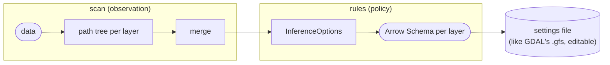

# Schema inference

GML datasets rarely come with a usable application schema (XSD). The schema is
therefore **inferred from the data**, in two separate steps:



- The **path tree** records *what was seen*. It makes no decisions.
- **`InferenceOptions`** decides *how to represent it*: nesting, flattening, types,
  naming.

Within one scan, changing the options needs no new pass: the same tree can produce
a nested schema for Parquet and a flat one for QGIS. The tree itself is not saved.
What is saved is the resulting schema, in the settings file (see
[section 2.7](#27-scan-results-and-the-settings-file)).

The same inference runs in two places:
- **`scan`**, over the whole input or its first N features, for every layer;
- **`read` without a schema**, over the first features of the requested layer
  ([section 6](#6-sampled-schemas)).

---

## 1. How other tools do it (for context)

| Tool | Approach | Limits |
|---|---|---|
| GDAL GML driver | XSD if one is present and simple enough → `.gfs` cache → otherwise a **full scan**. Flattens nested elements. Supports lists of scalars only. XML attributes become fields only with `GML_ATTRIBUTES_TO_OGR_FIELDS`. Widens types in a line: int → real → string | Nested and repeated complex properties are lost or flattened badly |
| GDAL GMLAS | Driven entirely by the XSD. Nested types become separate joined tables | Requires an XSD. Produces many tables |
| GDAL WFS | Schema from `DescribeFeatureType` | Server-dependent |
| DataFusion CSV/JSON | Samples the first N records (default 1000). arrow-json widening: int + float → float, anything + string → string | Sampling misses rare shapes. `Schema::try_merge` rejects conflicts between files |
| spark-xml | Samples. Attributes prefixed `_`, text stored in `_VALUE`. Nests as Struct/Array | Sampling. Lossy numeric inference |
| xmltodict | No schema. Attributes as `@attr`, text as `#text`. `force_list` option | Not a schema, only a mapping |

This design combines GDAL's full scan with Arrow's nested types and adds lossless
type rules.

---

## 2. The path tree

### 2.1 Top level

```rust
/// Everything a scan observed. In memory only; the settings file stores schemas, not trees.
pub struct DatasetObservation {
    pub gml_versions: BTreeSet<GmlVersion>,     // V2 | V3_1 | V3_2 (see version detection)
    pub layers: IndexMap<QName, LayerObservation>,
    pub source_context: Vec<SourceContext>,     // producer, WFS request (axis-order evidence)
}

pub struct LayerObservation {
    pub feature_count: u64,
    pub root: ElementNode,                      // the feature element itself
    pub extent: Option<Bbox>,                   // union of geometry bboxes, for listings
}

/// Namespace URI + local name. Never the prefix: prefixes differ between files/WFS pages.
pub struct QName { pub ns: Option<Arc<str>>, pub local: Arc<str> }
```

### 2.2 Element node

```rust
pub struct ElementNode {
    // occurrence → List detection; presence shown by --explain
    pub instances: u64,          // total occurrences of this element
    pub parents_with: u64,       // parent instances that contained it ≥ 1 time
    pub max_occurs: u32,         // max repetitions within ONE parent instance
    pub first_multi: Option<Location>,  // evidence: where max_occurs first exceeded 1

    // content shape
    pub text: Option<ValueStats>,       // non-whitespace text content
    pub mixed: bool,                    // text AND child elements in the same instance
    pub empty: u64,                     // <a/> or <a></a>
    pub nil: NilStats,                  // xsi:nil count + nilReason values (bounded set)

    // structure
    pub attributes: IndexMap<QName, ValueStats>,
    pub children: IndexMap<QName, ElementNode>,  // first-seen order → stable column order

    // GML-specific
    pub geometry: Option<GeometryStats>, // set when this is a geometry property
    pub by_reference: u64,               // instances that only had xlink:href, no content
    pub has_gml_id: u64,                 // instances with their own gml:id (nested object)
    pub name_shape: NameShape,           // UpperCamel (object/type) vs lowerCamel (property)

    pub truncated: bool,                 // depth/width limit hit; subtree not tracked
}
```

**Counting rules**

- `max_occurs` is counted **per parent instance**. The parse stack keeps a small
  counter per child name. When the parent element closes, the counters are folded
  into `max_occurs`.
- `parents_with < parent.instances` means the element is sometimes missing.
  `--explain` shows it; it doesn't affect the schema, because every column is
  nullable (see [type-mapping.md](type-mapping.md#nullability)).
- `first_multi` records `(source, byte_offset, feature_seq, gml:id)`. This is what
  `--explain` shows as the reason a column became a list.

**Geometry nodes are leaves.** When a property contains a GML geometry element, the
**property** node receives `GeometryStats`, and the scan does not go deeper.
Otherwise `exterior/LinearRing/posList` would appear as columns. During the scan,
coordinates are mostly not parsed. Only these are collected: the geometry element
kinds, the presence of curve segments, `srsName`, `srsDimension`, `axisLabels`, the
GML dialect, and the **first position of each geometry**. The positions feed the
axis-order range check (see [geometry.md](geometry.md#auto-evidence-based-decision)).

### 2.3 Value statistics

Each text value reports **every type it can be parsed as**. The statistics keep the
**intersection** across all values. This replaces GDAL's single widening line, which
can't handle types with no natural order (date vs int) and can't express whether a
conversion loses information.

```rust
pub struct ValueStats {
    pub count: u64,
    pub exact_text: TypeSet,     // parses AND prints back identically
    pub exact_value: TypeSet,    // the value survives a round trip through the Arrow type
    pub lossy: TypeSet,          // parses at all
    pub int_range: Option<(i64, i64)>,
    pub float_shape: Option<FloatShape>,   // max significant digits, max fractional scale
    pub temporal: Option<TemporalShape>,   // tz: Absent | Fixed(offset) | Mixed; max fraction digits
    pub max_len: u32,
    pub distinct: BoundedSet<Arc<str>>,    // up to N (default 64) values; dropped on overflow
}

bitflags! { pub struct TypeSet: u16 {
    const BOOL; const INT; const FLOAT; const DATE; const DATETIME;
    const TIME; const STRING;                      // STRING is always set
}}
```

| Value | `exact_text` | `exact_value` | `lossy` |
|---|---|---|---|
| `0012` | STRING | STRING (leading zeros ⇒ identifier) | INT, FLOAT, STRING |
| `1523.40` | STRING | FLOAT, STRING | FLOAT, STRING |
| `1` | INT, FLOAT, STRING | INT, FLOAT, STRING | + BOOL |
| `true` | BOOL, STRING | BOOL, STRING | BOOL, STRING |
| `2021-03-04` | DATE, STRING | DATE, STRING | DATE, DATETIME, STRING |
| `2021-03-04Z` | STRING | DATE, STRING (time zone recorded in `temporal`) | DATE, DATETIME, STRING |
| `2017-04-05T14:53:55+02:00` | DATETIME, STRING | DATETIME, STRING | DATETIME, STRING |
| `12345678901234567.89` | STRING | STRING (too many digits for f64) | FLOAT, STRING |

Rules for `exact_value`:
- **Leading zeros** in the integer part, as in `0012` or `-012` (but not `0` or `0.5`),
  rule out numeric types. Such values are almost always identifiers (codes,
  postcodes, TERYT).
- **Trailing zeros** after the decimal point are allowed (`1523.40` → `1523.4`). The
  maximum scale is kept in field metadata (`gml:max_scale`), so a writer can
  reproduce the original formatting.
- FLOAT requires the value's normalized decimal form to equal the shortest
  round-trip form of the parsed `f64`.
- `1`/`0` are BOOL only in `lossy`. In `exact_*`, only `true`/`false` are BOOL.

Only one of `exact_text` / `exact_value` / `lossy` is used, as set by
`TypeOptions.lossless`. The default is `Value`.

**Speed:** once a `TypeSet` contains only `STRING`, later values are not parsed.
Only `distinct`, `max_len` and `count` are updated.

### 2.4 Geometry statistics

```rust
pub struct GeometryStats {
    pub count: u64,
    pub kinds: BTreeSet<GmlGeomKind>,   // Point, LineString, Curve, Polygon, Surface, MultiSurface, …
    pub has_curves: bool,               // any arc/circle segment seen
    pub has_unsupported: bool,          // e.g. Solid, spline — see support-matrix
    pub dims: BTreeSet<u8>,             // effective srsDimension: 2, 3
    pub srs: BTreeMap<Arc<str>, u64>,   // srsName (as written) → count
    pub axis_evidence: BTreeMap<AxisKey, AxisEvidence>, // per (srsName, dialect):
                                        //   as-written bbox of sampled positions,
                                        //   axisLabels seen, envelope bboxes
    pub by_reference: u64,              // geometry given only as xlink:href
    pub empty: u64,
}
```

### 2.5 Merging

Every structure has a `merge(&mut self, other: Self)` operation that is
**associative and commutative**:

| Field | Merge |
|---|---|
| counts | add |
| `max_occurs`, `max_len` | max |
| `TypeSet`s | intersect |
| `int_range` | min/max |
| `distinct` | union until overflow, then dropped |
| `children`, `attributes` | merge by `QName`, recursively |
| `first_multi` | the earliest location |

This one property allows:
- a **parallel scan**: one tree per chunk, then merged;
- **multi-file inputs and WFS pages**: one tree per file or page, then merged.

Column order is the only non-commutative part. Children are ordered by their
earliest `(source_index, byte_offset)` of first appearance, which is deterministic
whatever the merge order.

### 2.6 Size

The tree grows with the **number of distinct element paths**, not with the file
size.

| Part | Approximate size |
|---|---|
| Node (counters, flags, evidence) | ~100 B |
| `ValueStats` without distinct values | ~80 B |
| `BoundedSet` (N = 64) | 0 – ~2.5 KB (dropped for high-cardinality fields) |

| Dataset shape | Nodes | Tree |
|---|---|---|
| Flat national layer (addresses, parcels) | 50–150 | 20–150 KB |
| Multi-layer package (~80 feature types) | 2k–8k | 0.5–5 MB |
| Dynamic element names | capped by `Limits.max_children` | bounded |

Memory during the scan is one tree per worker plus the parse stack, which is
negligible.

### 2.7 Scan results and the settings file

- A scan returns a `ScanResult`: the observation, the options used, and one
  `LayerSchema` per layer. In the same process it can produce schemas for other
  options (`scan.schema_with(layer, &options)`) without another pass.
- `ScanResult::to_settings()` gives the [settings file](architecture.md#settings-file):
  the options, the axis-order decision (one mode, plus per-srsName overrides only
  where keys were decided differently), and one
  `column → type` map per layer. This is what users keep and pass to later reads.
  The path tree is not saved.
- The settings file has no link to the data it came from: no fingerprints and no
  invalidation. It can be applied to any input with the same feature types (for
  example, one voivodeship's PRG scan for all 16). Data that doesn't fit ends up in
  `_overflow` and is counted in the read report (see [6.3](#63-data-that-doesnt-fit)).
- A read can also embed the schema it used in the output's Parquet key-value
  metadata (`gml:settings`), to record where it came from.

### 2.8 GML version detection

GML 2 and GML 3.1 share the namespace `http://www.opengis.net/gml`. GML 3.2 uses
`http://www.opengis.net/gml/3.2`. For the shared namespace, the version is
determined from:

1. `xsi:schemaLocation` pointing to `…/gml/2.x` or `…/gml/3.x`;
2. the WFS version and `outputFormat` for WFS responses;
3. the elements seen: `coordinates`, `outerBoundaryIs`, `coord` → 2;
   `pos`, `posList`, `exterior`, `Curve`, `Surface` → 3.1.

Geometry parsing accepts elements from all versions, so detection affects only
reporting and some defaults (for example, `boundedBy` handling).

---

## 3. `InferenceOptions`

```rust
pub struct InferenceOptions {
    pub naming: NamingOptions,
    pub structure: StructureOptions,
    pub types: TypeOptions,
    pub gml: GmlOptions,
    pub geometry: GeometryOptions,      // see geometry.md
    pub overrides: Vec<(PathPattern, FieldOverride)>,
    pub layers: Vec<(LayerSelector, InferenceOptionsPatch)>,   // per-layer adjustments
    pub limits: Limits,
}
```

### 3.1 Naming

```rust
pub struct NamingOptions {
    pub namespaces: NsMode,        // Strip | StripUnlessCollision (default) | Prefix | Clark
    pub attribute_prefix: String,  // "@" (fixed decision; configurable for compatibility)
    pub text_field: String,        // "#text": text of an element that also has attributes
    pub flatten_separator: String, // "." when flattening
}
```

- XML attributes **always** get the `@` prefix: `@gml:id` → `@id` once namespaces
  are stripped, `@xlink:href` → `@href`, `@uom`.
- `StripUnlessCollision`: namespace prefixes are removed unless two sibling
  elements would then have the same name, in which case both keep their prefix.

### 3.2 Structure

```rust
pub struct StructureOptions {
    pub nesting: Nesting,                  // Struct (default) | FlattenSingleOnly | Flatten{max_depth}
    pub lists: ListRule,                   // Infer (max_occurs > 1) (default) | Never(TakeFirst|Error)
    pub force_list: Vec<PathPattern>,      // xmltodict-style
    pub force_scalar: Vec<PathPattern>,
    pub simple_with_attrs: SimpleContent,  // Struct (default) | Split | ValueOnly
    pub constant_attrs: ConstantAttrs,     // ToFieldMetadata (default) | Keep
    pub collapse_type_wrappers: bool,      // default true
    pub mixed_content: MixedContent,       // RawXml (default) | TextOnly | Drop
    pub xml_attributes: AttrSelect,        // All (default) | None | Only(..) | Except(..)
}
```

**`nesting`**
- `Struct`: nested elements become `Struct`, repeated ones become `List(…)`.
  Lossless and suited to Parquet/SQL.
- `FlattenSingleOnly`: single-occurrence nesting is flattened (`owner.name`), and
  repeated nesting stays `List(Struct(…))`. This is flat wherever flattening loses
  nothing.
- `Flatten{max_depth}`: GDAL-like. Beyond `max_depth`, the subtree becomes raw XML.

**`simple_with_attrs`**: for an element with text and attributes, e.g.
`<area uom="m2">1523.40</area>`:
- `Struct`: `area: Struct("#text": Float64, "@uom": Utf8View)`
- `Split`: `area: Float64`, `area.@uom: Utf8View`
- `ValueOnly`: `area: Float64` (attributes dropped)

**`constant_attrs = ToFieldMetadata`**: if an attribute has exactly one distinct
value across the dataset (`uom="m2"` everywhere), it is moved into field metadata
(`gml:attr:uom = "m2"`) instead of becoming a column. When the attribute was the
element's only one, `area` then becomes a plain `Float64`. No information is lost.

**`collapse_type_wrappers`**: INSPIRE-style schemas wrap data types inside
properties:

```xml
<prgad:idIIP>
  <prgad:AD_IdentyfikatorIIP>          ← wrapper: object/type element
    <prgad:lokalnyId>…</prgad:lokalnyId>
```

The wrapper level is skipped when **all** of these hold:
- the property has exactly one child element name;
- that child has `name_shape == UpperCamel`;
- the child's `max_occurs == 1`;
- the property has no text and no attributes other than `xlink`/`nil` attributes;
- the wrapper has no attributes other than `@gml:id`.

The wrapper's `@gml:id`, if present, is kept. The result is
`idIIP: Struct("lokalnyId": …, "przestrzenNazw": …, "wersjaId": …)`, not
`idIIP.AD_IdentyfikatorIIP.lokalnyId`.

### 3.3 Types

```rust
pub struct TypeOptions {
    pub lossless: Lossless,            // Text | Value (default) | Lossy
    pub enabled: TypeSet,              // STRING only ⇒ GDAL's ALWAYS_STRING
    pub integers: IntWidth,            // Int64 (default) | Smallest
    pub timestamps: TimestampOptions,  // unit (µs default), mixed-tz handling
    pub empty_as_null: bool,           // default true
    pub all_null: AllNull,             // Utf8View (default) | Null type
    pub string_view: bool,             // Utf8View (default) vs Utf8
}
```

Type choice: take the chosen `TypeSet` ∩ `enabled`, then pick the first match in
this order: **BOOL → INT → FLOAT → DATE → DATETIME → TIME → STRING**.
[type-mapping.md](type-mapping.md) lists the resulting Arrow types.

`Int64` is the default width, not the smallest possible type. This keeps schemas
stable across files and WFS pages. Otherwise a column that is Int8 in one file and
Int16 in another has to be widened.

### 3.4 GML-specific

```rust
pub struct GmlOptions {
    pub gml_id: IdMode,                // Column (default; "@id") | Drop
    pub xlink: XlinkMode,              // Href (default) | Full{href,title,role,arcrole} | Drop
    pub strip_local_href_hash: bool,   // "#PL.X.1" → "PL.X.1" (default true)
    pub nil_reason: bool,              // keep nilReason as "<field>.@nilReason" (default true when seen)
    pub bounded_by: BoundedBy,         // Drop (default) | BoxStruct | Geometry
    pub standard_props: StdProps,      // gml:name/description/identifier handling
}
```

- Properties given only by reference, such as
  `<prgad:miejsce xlink:href="#…"/>`, become `miejsce: Struct("@href": Utf8View)`.
  When the property never has other content or attributes, this is simplified to
  `miejsce: Utf8View` holding the href. Repeated ones (`adres2`) become
  `List(Utf8View)`. These act as foreign keys to another layer's `@id`.
- `xsi:nil="true"` means null. `nilReason` is kept if configured.

### 3.5 Overrides and limits

```rust
pub enum FieldOverride {
    Type(DataType), Rename(String), Drop, AsRawXml, AsMap, List, Scalar, Geometry(GeometryOverride),
}

pub struct Limits {
    pub max_depth: u16,       // default 16 → deeper subtrees become Map / raw XML
    pub max_children: u16,    // default 512 → element with more distinct child names becomes Map
    pub distinct_values: u16, // BoundedSet capacity (default 64)
}
```

`PathPattern` matches local names with globs, optionally namespace-qualified:
`AD_PunktAdresowy/idIIP`, `*/area`, `**/@uom`, `{https://geoportal.gov.pl/schemas/prgad/1.0}*/**`.

### 3.6 Presets

| Preset | Summary |
|---|---|
| `default()` | Lossless by value, `Struct` nesting, `@` attributes, rich types, geometry encoding `Auto` |
| `flat()` | `FlattenSingleOnly` + `Split`. Aimed at Parquet users who want flat columns and QGIS |
| `gdal_like()` | `Flatten`, `Split`, lists of scalars only, `Lossy` types, attributes dropped |
| `spark_xml_like()` | `_` attribute prefix, `_VALUE` text field, `Struct` |
| `strings()` | Every scalar as `Utf8View` |

---

## 4. The rule engine

The engine is a single recursive walk over each layer's tree:

```
fn field_for(node, parent_ctx, opts) -> Option<Field>:
    if override matches            → apply override
    if node.geometry.is_some()     → geometry column (geometry.md)
    if node.truncated              → Map or raw XML
    if collapse_type_wrappers and node is wrapper → field_for(only child, …) with node's name

    inner = match shape(node):
        TextOnly                   → scalar(node.text, opts.types)
        TextAndAttrs               → simple_with_attrs rule
        ElementsOnly               → Struct(children…) or flatten into parent
        ByReferenceOnly            → Utf8View (href)
        Mixed                      → mixed_content rule
        Empty (never had content)  → all_null type

    if is_list(node)  (max_occurs > 1 || force_list) && !force_scalar → List(inner)
    nullable = true   (always; see type-mapping.md "Nullability")
    attach metadata: gml:path, gml:max_scale, gml:attr:*, gml:srs_name, …
```

Every field records its source path in metadata (`gml:path`). The reader uses this
to send values straight to the right builder, without looking up names at runtime.

---

## 5. Worked example: PRG `AD_PunktAdresowy`

The observed tree below is based on a sample of about 410k address points from the
Lubelskie file:

```
prgad:AD_PunktAdresowy           features ~410k        @gml:id exact_value{STRING}
├─ idIIP                         present always, max 1  (elements only)
│  └─ AD_IdentyfikatorIIP        [UpperCamel, only child] → type wrapper
│     ├─ lokalnyId               text {STRING}                       ← UUID
│     ├─ przestrzenNazw          text {STRING} distinct{"PL.PZGIK.200"}
│     └─ wersjaId                text {DATETIME tz=Fixed(+02:00)…, STRING}
├─ poczatekWersjiObiektu         text {DATETIME tz=Absent, STRING}
├─ numerPorzadkowy               text {STRING}                       ← "27a", "33"
├─ georeferencja  [GEOMETRY]     kinds{Point} dims{2} srs{"EPSG:2180"}
├─ kodPocztowy                   text {STRING}                       ← "22-120"
├─ dataNadania                   present ~52%; text {DATE, STRING}
├─ miejscowosc                   by_reference = instances            ← xlink only
└─ ulica2                        present ~13%; by_reference
```

Default schema (`InferenceOptions::default()`; every column nullable):

```
@id:                   Utf8View
idIIP:                 Struct("lokalnyId": Utf8View,
                              "przestrzenNazw": Utf8View,
                              "wersjaId": Timestamp(µs, "UTC"))
poczatekWersjiObiektu: Timestamp(µs)
numerPorzadkowy:       Utf8View                     ("33" alone would be INT; "27a" rules it out)
georeferencja:         geoarrow.point<xy>           crs = EPSG:2180
kodPocztowy:           Utf8View
dataNadania:           Date32
miejscowosc:           Utf8View                     (href, '#' stripped) → FK to AD_Miejscowosc.@id
ulica2:                Utf8View                     → FK to AD_UlicaPlac.@id
```

The layer `AD_UlicaPlac` in the same file shows repeated references:
`<prgad:adres2 xlink:href="#…"/>` appears several times per street, so it becomes
`adres2: List(Utf8View)`.

`przestrzenNazw` has a single constant value but stays a column. Only XML
*attributes* with a constant value are moved to metadata. A text element with a
constant value is still data.

---

## 6. Sampled schemas

A schema inferred from part of the data is a **sampled schema**. There are two
ways to get one:

- `read` without a schema samples the requested layer;
- `xeibe scan --sample N` (`ScanExtent::Sample`) scans only the first N features of
  the input.

### 6.1 Sampling in a read

```rust
pub struct SampleOptions {
    pub features_per_layer: u64,     // default 10_000
    pub max_buffer_bytes: u64,       // default 256 MiB
    pub min_typed_values: u64,       // default 100, see 6.2
    pub conservative: bool,          // default true, see 6.2
}
```

- **The sample is taken from the requested layer, not from the start of the file.**
  PRG stores its layers one after another: tens of thousands of `AD_Miejscowosc`
  come first, then `AD_UlicaPlac`, then millions of `AD_PunktAdresowy`. The
  splitter skips the other layers, so the sample is the first `features_per_layer`
  address points, wherever they start.
- The sampled features are buffered. When the sample is full, or the buffer reaches
  `max_buffer_bytes`, or the input ends, the schema is inferred from the sample's
  path tree and **frozen**. The reader's schema becomes known at that moment. The
  buffered features are then emitted first, followed by the rest of the stream.
- Axis-order evidence ([geometry.md](geometry.md#auto-evidence-based-decision)) and
  the CRS for the column metadata come from the same sample.
- The frozen schema is in the read report, in settings-file form. Saving it makes
  the next read of the same kind of data one-pass with a known schema.

A sampled **scan** is simpler: it stops after the first N features of the input,
whatever their layers. Layers that start later are missing from the result, and
layers with few sampled features get weak type evidence. It is a quick look, not
a substitute for a full scan.

### 6.2 Conservative types

A schema can't change after the first batch is written (a Parquet file has a single
schema), so type choices in a sampled schema must be safe for data that hasn't been
seen yet. With `conservative = true`, these adjustments are applied on top of any
preset:

| Rule | Full scan | Sampled, conservative |
|---|---|---|
| Typed columns (anything but string) | any evidence | at least `min_typed_values` non-null values in the sample; otherwise `Utf8View` |
| Integer width | `integers` option | always `Int64` |
| Date-only values | `Date32` | `Date32` (a later timestamp goes to `_overflow`) |
| Geometry encoding `Auto` | native type if the scan saw one simple kind | `geoarrow.wkb` (a `Polygon` sample says nothing about later `MultiPolygon`s) |
| Lists | from `max_occurs` | same (later repetition goes to `_overflow`) |

### 6.3 Data that doesn't fit

Any schema used by a read can meet data it doesn't describe: a sampled schema, a
settings file from an older release of the data, or a schema written by hand.

| Situation | `Overflow` (default) | `Error` | `Drop` |
|---|---|---|---|
| Unknown element/attribute | `_overflow[path] = raw text / XML` | error | ignored |
| Unexpected repetition of a scalar | first value in the column, rest in `_overflow` | error | first value kept |
| Value doesn't parse as column type | column null, `_overflow[path] = value` | error | null |
| Unknown geometry kind for a native column | null, raw GML in `_overflow` | error | null |

- With `Overflow`, every read appends `_overflow: Map(Utf8View → Utf8View)` to the
  schema, unless the given schema already has it. When it is never used, it stays
  null, which is cheap.
- The read report counts overflow entries per path. A new scan turns them into
  proper columns.

---

## 7. `--explain`

`xeibe scan <src> --explain` prints every field with its reason and evidence:

```
adres2        List(Utf8View)      list: max_occurs=3 (first at feature #1204, gml:id=PL.ZIPIN…, byte 91 233 812)
                                  item: by-reference only (xlink:href), '#' stripped
georeferencja geoarrow.point      geometry: kinds={Point}, dims={2}; encoding Auto → native point
                                  crs: "EPSG:2180" short form → x/y axis order (no swap)
kodPocztowy   Utf8View            numeric rejected: values like "22-120" are not numeric
dataNadania   Date32              present in 211 995 / 410 402 parents
idIIP         Struct(…)           type wrapper AD_IdentyfikatorIIP collapsed
```
