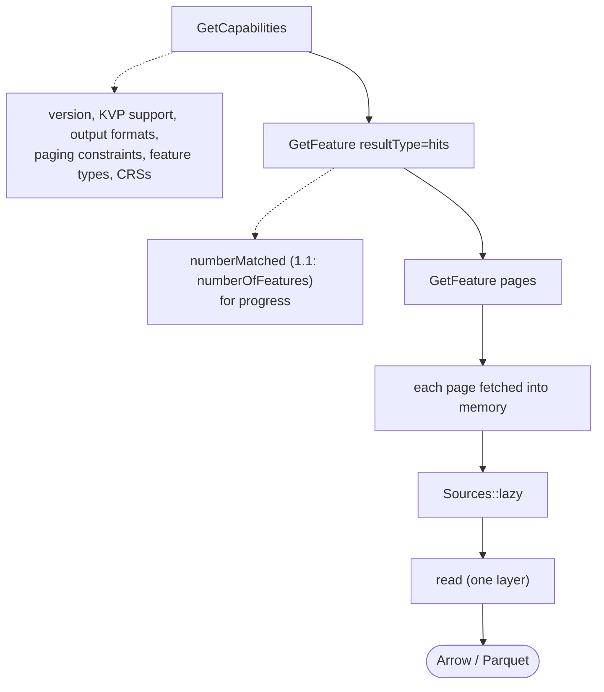

# WFS client

`xeibe-wfs` is a **bulk-read** client: it fetches every feature of one feature type
from a WFS, with paging, and streams the pages into a normal read. It is not a
general WFS SDK, and it stores nothing: no saved pages, no manifest, no resume.

References (PDFs in `ogc_schemas/`):
- WFS 2.0.2 (OGC 09-025r2). §-numbers below refer to this document unless stated otherwise;
- WFS 1.1.0 (OGC 04-094);
- WFS 1.0.0 (OGC 02-058);
- OWS Common 2.0 (OGC 06-121r9);
- Filter Encoding 2.0.2 (OGC 09-026r2).

## Flow

- `xeibe_wfs::pages(endpoint, type_name, &options)` returns the pages as a lazy
  sequence of sources (see [architecture.md](architecture.md#sources-and-remote-input)).
  `read` pulls the next page when it needs more features. A scan pulls them too.
- **A page is fetched completely into memory before it is parsed.** Pages are
  bounded by the page size (typically a few MB to tens of MB), and a whole page
  can be retried, or re-requested with half the page size after a truncated
  response, without emitting any feature twice.
- The schema is given (a settings file) or sampled from the first pages, like any
  other read. A scan followed by a read fetches every page twice. That is the
  user's choice.
- A failure that retries can't fix fails the read. There is no resume. The user
  reruns it.

HTTP (retries, backoff, auth) comes from `xeibe-io` and is shared with plain file
reads.

## Capabilities

What we read from `GetCapabilities`:

| Item | WFS 2.0 | WFS 1.1 | WFS 1.0 | Used for |
|---|---|---|---|---|
| Feature types | `FeatureTypeList/FeatureType`: `Name`, `Title`, `DefaultCRS`, `OtherCRS`, `OutputFormats`, `ows:WGS84BoundingBox` | same, but `DefaultSRS`/`OtherSRS` | `Name`, `Title`, `SRS`, `LatLongBoundingBox` | `xeibe wfs layers`, default CRS, bbox checks |
| KVP support | `KVPEncoding` constraint (Table 13) | assumed | assumed | Use `GET`, or fall back to `POST` |
| Paging support | `ImplementsResultPaging` (Table 13) | — | — | Paging strategy |
| Server page limit | `CountDefault` (Table 14) | — | — | Page size cap |
| Paging consistency | `PagingIsTransactionSafe` (Table 14, default FALSE) | — | — | Warns that duplicates or skipped features are possible |
| Page cache lifetime | `ResponseCacheTimeout` (Table 14, seconds) | — | — | Resume strategy for `next` links |
| Output formats | `GetFeature` `outputFormat` parameter domain | same | `ResultFormat` (`GML2`) | Format negotiation |

## Paging

### What the standard says (WFS 2.0.2 §7.7.4.4)

- Paging happens only when the request sets `count`, **or** the server has a
  `CountDefault`.
- Each response may carry `next` and `previous` attributes: **URIs generated by the
  server**, whose format is up to the implementation. The last page has no `next`.
- The server may drop the cached result set after `ResponseCacheTimeout`. Following a
  `next` link after that returns a **`ResponseCacheExpired`** exception.
- `PagingIsTransactionSafe = FALSE`, the default, means data may change between
  pages: "it is possible to have a result set element be skipped or duplicated
  between iterations".
- `startIndex` (§7.6.3.4) is the index in the result set where the response starts.
  It is 0-based: the default is 0 (§7.6.3.2).
- `count` (§7.6.3.5) counts **only features of the requested types**. Nested
  features inside properties, and features referenced by xlink, are not counted.
  In a join, each tuple counts once.

### Strategies

Chosen automatically in this order, and can be overridden:

| Strategy | Condition | Notes |
|---|---|---|
| **`next` link** | WFS 2.0 response has `next` | Follow it until there is none. On `ResponseCacheExpired`, switch to `startIndex` at the number of features fetched so far, if supported. Otherwise the read fails |
| **`startIndex` + `count`** | WFS 2.0 with `ImplementsResultPaging = TRUE`, or forced | Page size = `min(user page size, CountDefault)`. Stops when `numberReturned < count` or the total reaches `numberMatched` |
| **Vendor `startIndex` on 1.x** | WFS 1.1/1.0 on servers known to support it (GeoServer, some MapServer) | `maxFeatures` + `startIndex`. Enabled with an explicit flag |
| **Spatial tiling** | No paging support | Split the bbox into tiles until each tile's `hits` count is below the server limit. Duplicates across tile edges are removed by `gml:id` within the run (🤔 Considering) |
| **Single request** | Small layers, or forced | Warns if `numberReturned < numberMatched` |

### Stable ordering and duplicates

Offset-based paging is only correct when the order is stable. The standard itself
warns that pages may overlap or skip features without transactional consistency.

- Default: send `SORTBY` on an identifier property when one can be found (configured
  by the user or detected from the data). Syntax:
  - 2.0: `SORTBY=prop [ASC|DESC],…` (Table 8);
  - 1.1: `SORTBY=prop [A|D],…` (04-094 Table for GetFeature KVP).
- Always: check `gml:id` for duplicates across pages and **report** them. Removing
  duplicates is optional, because it needs a set of ids and memory proportional to
  their count.
- Compare `numberMatched` at the start and at the end. A changed count means the
  data changed during the read, and a warning is raised.

## Response structure

| Case | Structure | Handling |
|---|---|---|
| Single query (2.0) | `wfs:FeatureCollection` → `wfs:member` → feature (§11.3.3.4) | Normal |
| Several queries (2.0) | `wfs:FeatureCollection` → `wfs:member` → `wfs:FeatureCollection` per query, in query order. Inner collections may be inline **or referenced by `xlink:href`**. A feature matching several queries appears in one collection and is referenced from the others (§11.3.3.5) | Inner members become layers as usual. Referenced members are counted and reported, not fetched |
| Join (2.0) | `wfs:member` → `wfs:Tuple` (§11.3.3.6) | Not supported |
| `resolve` used (2.0) | Referenced objects are placed in `wfs:additionalObjects`, and references are changed to point to them (§11.3.4) | Planned P2: read as features of their own layers |
| `GetFeatureById` stored query | The bare feature, without any collection element (§11.3.5) | "Single feature as document root" |
| `resultType=hits` | Empty collection with `numberMatched` (2.0), or `numberOfFeatures` (1.1) holding the **total** | Count only |
| WFS 1.1 results | `wfs:FeatureCollection` with `numberOfFeatures` = features **in this response** (04-094 §9.3) | Progress only. 1.1 has no total count in results |
| WFS 1.0 results | `wfs:FeatureCollection` → `gml:featureMember`, GML 2 | Normal |

`numberMatched` may be `"unknown"` (§7.7.4.2). If `count` isn't set and the server
has no `CountDefault`, `numberReturned` equals `numberMatched` (§7.7.4.3).

## Request encoding (KVP)

| Parameter | 2.0 | 1.1 | 1.0 | Notes |
|---|---|---|---|---|
| Service/version | `SERVICE=WFS&VERSION=2.0.2` (or `2.0.0`) | `1.1.0` | `1.0.0` | |
| Feature type | `TYPENAMES` | `TYPENAME` | `TYPENAME` | Mandatory unless `RESOURCEID` is used (Table 8) |
| Namespaces | `NAMESPACES=xmlns(prefix,uri)` | `NAMESPACE=xmlns(prefix=uri)` | — | Sent when the type name has a prefix. Some servers require it |
| Page size | `COUNT` | `MAXFEATURES` | `MAXFEATURES` | For 1.x, `MAXFEATURES` counts only requested types; a nested collection counts as one (04-094 §9.2) |
| Offset | `STARTINDEX` | vendor | vendor | |
| CRS | `SRSNAME` | `SRSNAME` | `SRSNAME` | Must be `DefaultCRS` or an `OtherCRS` of the type, otherwise `InvalidParameterValue`. WFS 1.1 servers must accept `EPSG:<code>`, `http://www.opengis.net/gml/srs/epsg.xml#<code>` and `urn:EPSG:geographicCRS:<code>` (04-094 §9.2) |
| Output format | `OUTPUTFORMAT` | `OUTPUTFORMAT` | `OUTPUTFORMAT` | Preference: `application/gml+xml; version=3.2` → `text/xml; subtype=gml/3.1.1` (1.1 default) → `text/xml; subtype=gml/2.1.2` / `GML2` |
| Bounding box | `BBOX=minx,miny,maxx,maxy[,crs]` | same | same | Values in **the CRS's axis order**, lower corner then upper corner (06-121r9 §10.2.3). Default CRS is the type's `DefaultCRS`. A single bbox applies to all queries |
| Filter | `FILTER` (FES 2.0 XML) | `FILTER` (Filter 1.1) | `FILTER` (Filter 1.0) | Passed through as-is. Mutually exclusive with `BBOX`/`RESOURCEID` |
| Properties | `PROPERTYNAME` | `PROPERTYNAME` | `PROPERTYNAME` | |
| Sorting | `SORTBY` | `SORTBY` | — | See above |
| Result type | `RESULTTYPE=hits` | `RESULTTYPE=hits` | — | |
| Resolution | `RESOLVE`, `RESOLVEDEPTH`, `RESOLVETIMEOUT` | `TRAVERSEXLINKDEPTH`, `TRAVERSEXLINKEXPIRY` | — | 🤔 Considering |
| Vendor | anything (`CQL_FILTER`, …) | same | same | `--param key=value` |

**Several queries in one KVP request** (2.0): each parameter's values are grouped in
parentheses, one group per query, and every query must use the same optional
parameters (Table 8 notes). We send one query per request instead. It's simpler,
and paging then applies to one type at a time. Multi-query responses from other
tools are still read correctly.

`POST` with an XML body is planned (P2) for filters too long for a URL.

## Errors and robustness

| Condition | Detection | Action |
|---|---|---|
| OWS exception | `ows:ExceptionReport` (1.1/2.0) or `ServiceExceptionReport` (1.0), **also inside HTTP 200 responses** | Error with `exceptionCode`, `locator` and the message |
| `ResponseCacheExpired` | exception code | Resume via `startIndex` (see above) |
| `OperationProcessingFailed` / `OperationParsingFailed` | exception code | No retry. Report the request |
| Truncated response | `wfs:truncatedResponse` (2.0), or no closing collection element | Retry with half the page size (up to N times) |
| HTTP 5xx, 429, network errors | status | Exponential backoff. Respects `Retry-After` |
| Changed `numberMatched` | start vs. end | Warning |
| Duplicate `gml:id` | id set | Reported. Optionally removed |

Also:
- gzip/deflate `Content-Encoding`.
- Configurable concurrency (default 1–2 requests in flight, to be polite to
  servers). Rate limit option. Concurrent requests are only possible with
  `startIndex` paging; `next` links can only be followed one after another.
  Pages fetched ahead are held in memory and handed to the read in order.
- Authentication: HTTP basic, bearer token, custom headers.

## Out of scope

- WFS-T (Transaction), LockFeature, GetFeatureWithLock.
- GetPropertyValue.
- Stored-query management (Create/Drop). `GetFeatureById`, `ListStoredQueries` and
  `DescribeStoredQueries` may come later.
- Joins (`wfs:Tuple`).
- `previous` links (not needed to page forward).
- OGC API – Features (WFS 3). It is GeoJSON/JSON-based and belongs in a different
  tool. Its GML output encoding is not planned.
